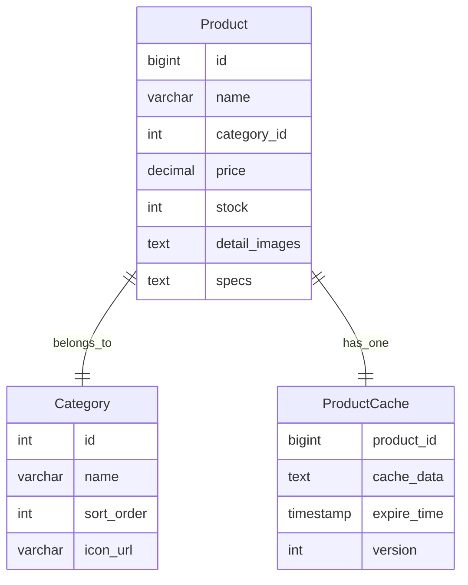
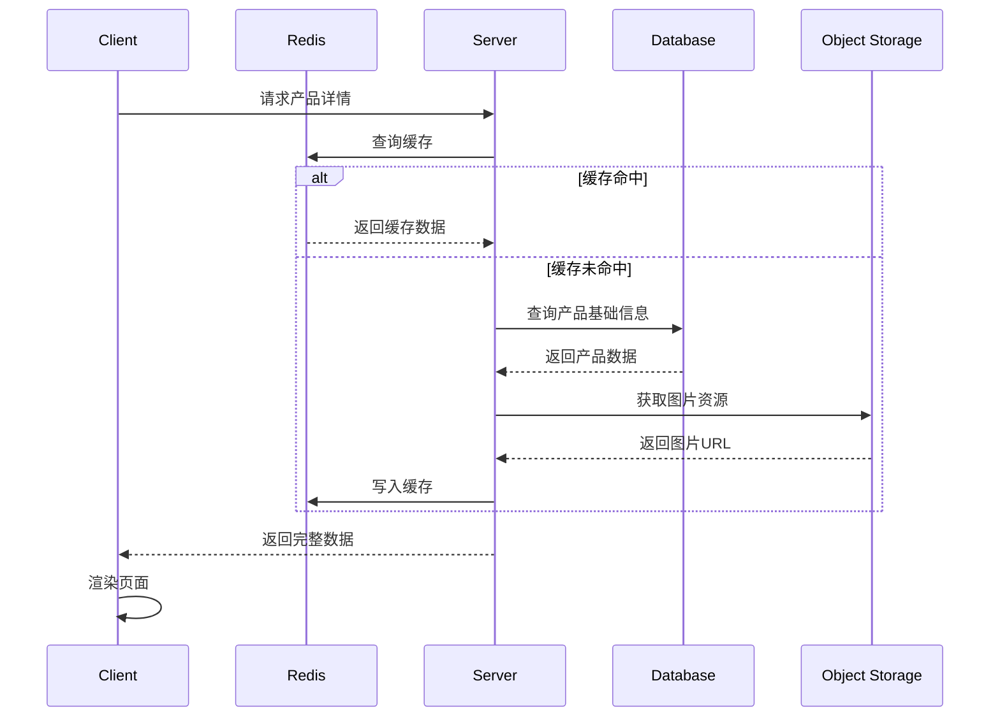

# 自行车销售网站概要设计文档

## 1. 数据结构设计

### 1.1 产品表(Product)
```sql
CREATE TABLE product (
    id BIGINT PRIMARY KEY AUTO_INCREMENT COMMENT '产品ID',
    name VARCHAR(100) NOT NULL COMMENT '产品名称',
    category_id INT NOT NULL COMMENT '分类ID',
    price DECIMAL(10,2) NOT NULL COMMENT '价格',
    stock INT NOT NULL COMMENT '库存',
    image_url VARCHAR(255) COMMENT '主图URL',
    description TEXT COMMENT '产品描述',
    detail_images TEXT COMMENT '详情图片URLs,JSON数组格式',
    specs TEXT COMMENT '规格参数,JSON格式',
    status TINYINT DEFAULT 1 COMMENT '状态:1-上架,0-下架',
    created_at TIMESTAMP DEFAULT CURRENT_TIMESTAMP,
    updated_at TIMESTAMP DEFAULT CURRENT_TIMESTAMP ON UPDATE CURRENT_TIMESTAMP,
    FOREIGN KEY (category_id) REFERENCES category(id)
);
```

### 1.2 分类表(Category) 
```sql
CREATE TABLE category (
    id INT PRIMARY KEY AUTO_INCREMENT COMMENT '分类ID',
    name VARCHAR(50) NOT NULL COMMENT '分类名称',
    sort_order INT DEFAULT 0 COMMENT '排序',
    icon_url VARCHAR(255) COMMENT '图标URL',
    status TINYINT DEFAULT 1 COMMENT '状态:1-启用,0-禁用'
);
```

### 1.3 产品缓存表(ProductCache)
```sql
CREATE TABLE product_cache (
    product_id BIGINT PRIMARY KEY COMMENT '产品ID',
    cache_data TEXT COMMENT '缓存的JSON数据',
    expire_time TIMESTAMP COMMENT '过期时间',
    version INT DEFAULT 1 COMMENT '版本号',
    FOREIGN KEY (product_id) REFERENCES product(id)
);
```

## 2. 实体关系图



## 3. 产品详情加载时序图



## 4. 缓存策略设计

### 4.1 多级缓存
- 浏览器端: 静态资源缓存(图片/CSS/JS)
- CDN: 图片资源缓存
- Redis: 产品数据缓存
  - 热点数据: 60分钟
  - 普通数据: 30分钟
  - 首页数据: 5分钟

### 4.2 缓存更新策略
- 更新DB时主动失效缓存
- 定时任务检查过期缓存
- 版本号控制缓存一致性

## 5. 图片存储方案

### 5.1 阿里云OSS方案
```yaml
Storage:
  provider: aliyun-oss
  bucket: bike-shop
  domain: img.bikeshop.com
  configs:
    image_quality: 75
    thumbnail_sizes: 
      - 200x200
      - 400x400
    format: webp
```

## 6. 性能优化方案

### 6.1 数据库优化
- 产品表索引设计
```sql
CREATE INDEX idx_category_status ON product(category_id, status);
CREATE INDEX idx_updated_at ON product(updated_at);
```

### 6.2 接口性能
- 详情页接口限流: 1000次/分钟
- 列表页分页: 默认20条/页
- 图片延迟加载
- 大字段按需加载

## 7. 核心接口

### 7.1 产品详情接口
```
GET /api/products/{id}

Response:
{
    "code": 200,
    "data": {
        "id": 1,
        "name": "string",
        "price": 0.00,
        "description": "string",
        "detailImages": ["url1", "url2"],
        "specs": {
            "frameSize": "string",
            "weight": "number"
        }
    }
}
```