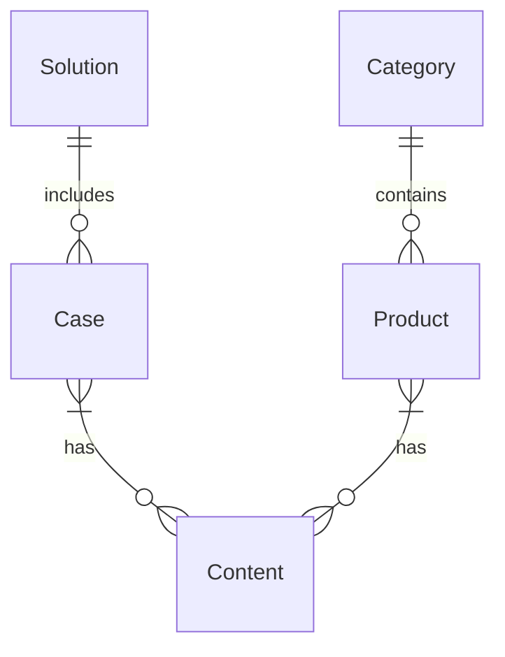
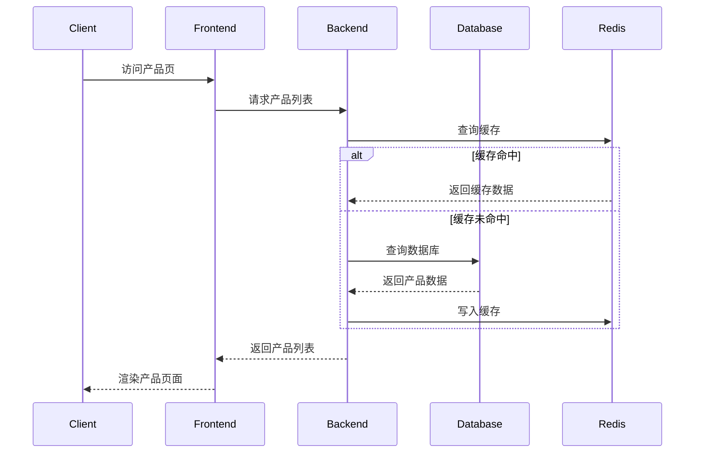
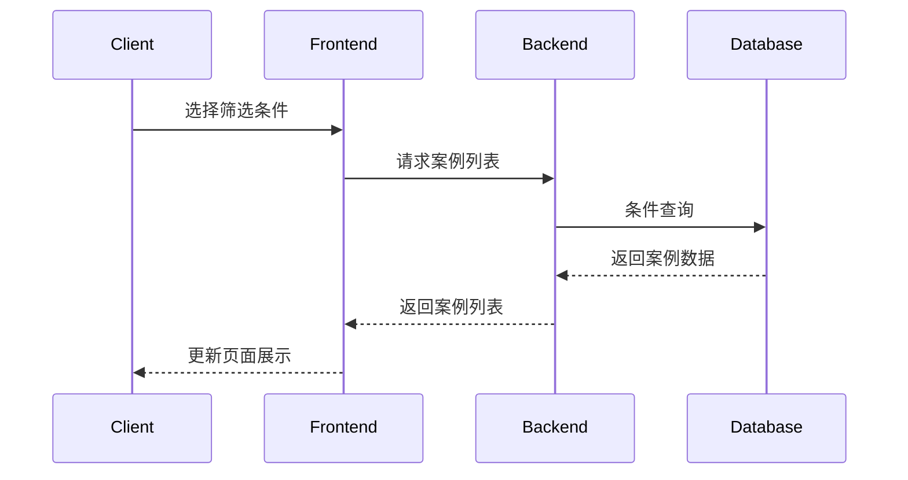

# B端官网系统概要设计文档 V2

## 1. 技术架构
```
Frontend(React) -> Nginx -> Backend(Node.js) -> MySQL/Redis
```

## 2. 数据建模

### 2.1 核心实体 
```sql
-- 产品表
Product {
  id: int(pk)
  name: varchar
  description: text 
  category_id: int(fk)
  image_url: varchar
  sort: int
  create_time: datetime
  update_time: datetime
  status: tinyint
}

-- 解决方案表
Solution {
  id: int(pk)
  title: varchar
  industry: varchar
  content: text
  architecture: text 
  benefits: text
  sort: int
  create_time: datetime
  status: tinyint
}

-- 客户案例表
Case {
  id: int(pk)
  title: varchar
  description: text
  industry: varchar
  solution_id: int(fk)
  logo_url: varchar
  sort: int 
  create_time: datetime
  status: tinyint
}

-- 内容管理表
Content {
  id: int(pk)
  type: varchar
  title: varchar 
  content: text
  position: varchar
  sort: int
  create_time: datetime
  status: tinyint
}

-- 类别表
Category {
  id: int(pk)
  name: varchar
  parent_id: int
  sort: int
  status: tinyint
}
```

## 3. 实体关系图


## 4. 核心流程

### 4.1 产品展示流程


### 4.2 案例查询流程 


## 5. API接口

### 5.1 产品接口
```
GET /api/products - 获取产品列表
GET /api/products/:id - 获取产品详情
POST /api/products - 创建产品
PUT /api/products/:id - 更新产品
DELETE /api/products/:id - 删除产品
```

### 5.2 解决方案接口
```
GET /api/solutions - 获取解决方案列表
GET /api/solutions/:id - 获取解决方案详情
POST /api/solutions - 创建解决方案
PUT /api/solutions/:id - 更新解决方案
DELETE /api/solutions/:id - 删除解决方案
```

## 6. 部署架构
```
        [CDN]  
          ↓
    [负载均衡(Nginx)]
          ↓
  [Web服务器集群(Node.js)]
          ↓
   [Redis集群] [MySQL主从]
```