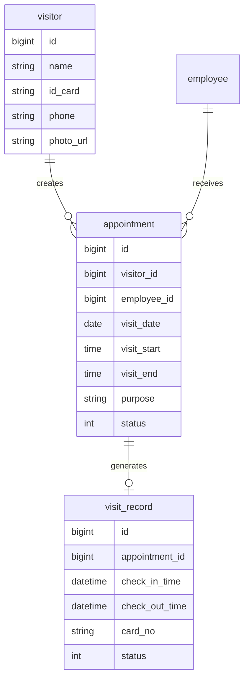
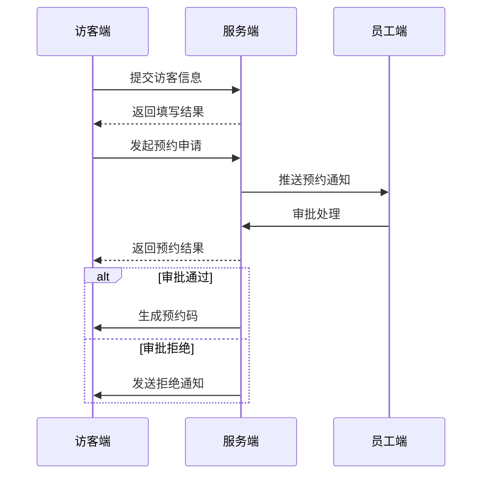
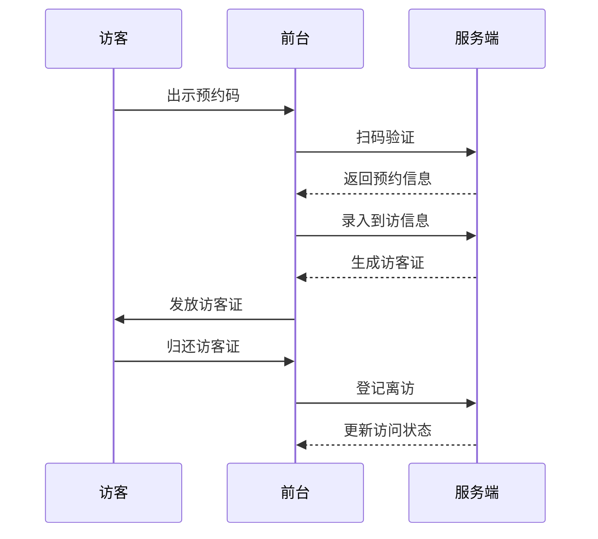

# 小鹏访客系统概要设计文档

## 1. 数据结构设计

### 1.1 核心数据表

#### 访客信息表(visitor)
```sql
CREATE TABLE visitor (
    id BIGINT PRIMARY KEY,           -- 访客ID
    name VARCHAR(50),                 -- 姓名
    id_card VARCHAR(18),             -- 身份证号
    phone VARCHAR(11),               -- 手机号
    photo_url VARCHAR(200),          -- 照片URL
    created_at DATETIME,             -- 创建时间
    updated_at DATETIME              -- 更新时间
);
```

#### 预约记录表(appointment)
```sql
CREATE TABLE appointment (
    id BIGINT PRIMARY KEY,           -- 预约ID 
    visitor_id BIGINT,               -- 访客ID
    employee_id BIGINT,              -- 被访人ID
    visit_date DATE,                 -- 访问日期
    visit_start TIME,                -- 开始时间
    visit_end TIME,                  -- 结束时间
    purpose VARCHAR(200),            -- 来访目的
    status TINYINT,                  -- 状态(0待审批/1已通过/2已拒绝)
    appointment_code VARCHAR(32),     -- 预约码
    created_at DATETIME              -- 创建时间
);
```

#### 访问记录表(visit_record)
```sql
CREATE TABLE visit_record (
    id BIGINT PRIMARY KEY,           -- 记录ID
    appointment_id BIGINT,           -- 预约ID
    check_in_time DATETIME,          -- 签到时间
    check_out_time DATETIME,         -- 签出时间
    card_no VARCHAR(32),             -- 访客证号
    status TINYINT,                  -- 状态(1在访/2已结束)
    created_at DATETIME              -- 创建时间
);
```

## 2. 实体关系图



## 3. 核心流程时序图

### 3.1 访客预约流程



### 3.2 访客接待流程



## 4. 关键接口设计

### 4.1 预约创建接口
```json
POST /api/appointment/create
Request:
{
    "visitor": {
        "name": "张三",
        "idCard": "330xxxxxxxxxxxxxxx",
        "phone": "138xxxxxxxx"
    },
    "appointment": {
        "employeeId": 12345,
        "visitDate": "2024-01-20",
        "visitStart": "09:00",
        "visitEnd": "18:00",
        "purpose": "业务洽谈"
    }
}

Response:
{
    "code": 200,
    "data": {
        "appointmentId": 67890,
        "appointmentCode": "AP202401200001"
    }
}
```

### 4.2 预约审批接口
```json
POST /api/appointment/approve
Request:
{
    "appointmentId": 67890,
    "approved": true,
    "comment": "同意访问"
}

Response:
{
    "code": 200,
    "message": "审批成功"
}
```