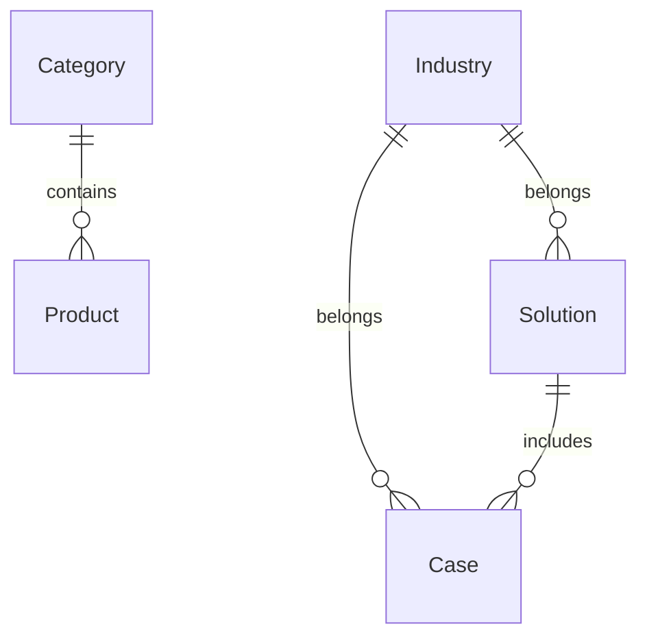
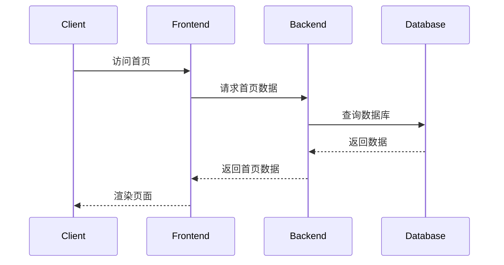
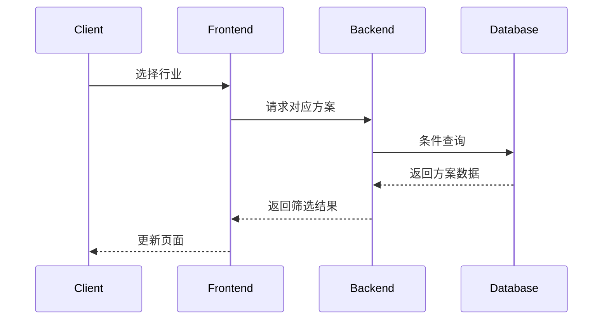
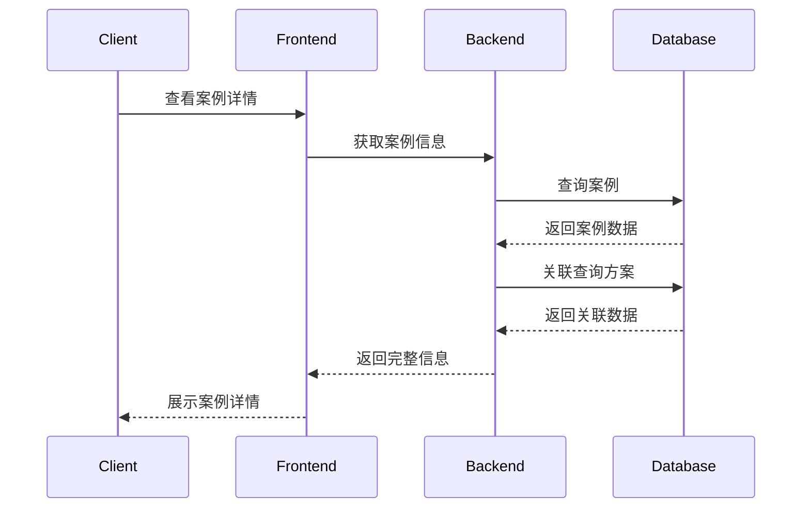

# B端官网系统概要设计文档 V4

## 1. 数据建模

### 1.1 核心实体
```sql
-- 产品表
Product {
  id: int(pk)
  name: varchar
  description: text
  category_id: int(fk) 
  features: text
  tech_specs: text
  image_urls: json
  sort: int
  create_time: datetime
  status: tinyint
}

-- 解决方案表  
Solution {
  id: int(pk)
  title: varchar
  content: text
  highlights: json
  arch_diagram: varchar
  industry_id: int(fk)
  sort: int
  create_time: datetime
  status: tinyint
}

-- 行业表
Industry {
  id: int(pk)  
  name: varchar
  icon: varchar
  sort: int
  status: tinyint
}

-- 客户案例表
Case {
  id: int(pk)
  title: varchar
  description: text
  industry_id: int(fk)
  solution_id: int(fk) 
  logo: varchar
  images: json
  sort: int
  create_time: datetime
  status: tinyint
}

-- 类别表
Category {
  id: int(pk)
  name: varchar
  icon: varchar
  parent_id: int
  sort: int 
  status: tinyint
}
```

## 2. 实体关系图


## 3. 核心流程

### 3.1 首页加载流程


### 3.2 方案筛选流程


### 3.3 案例查看流程
