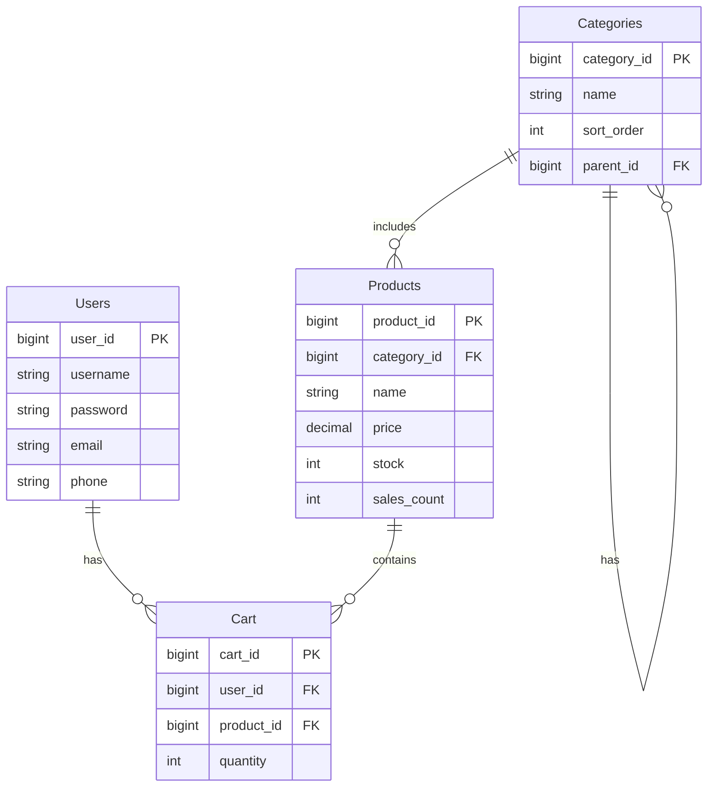
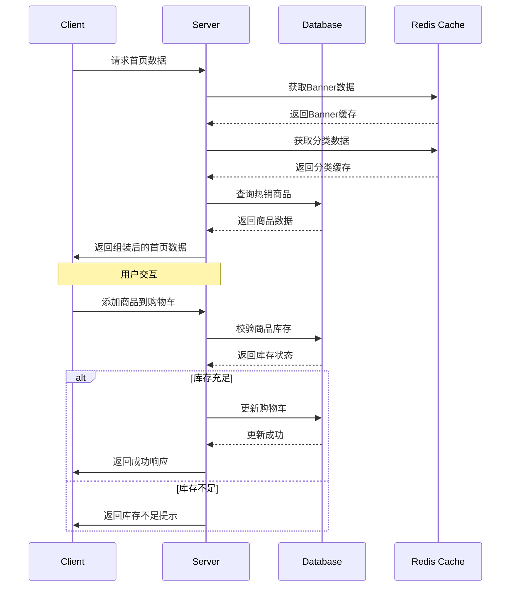

# 自行车销售网站首页概要设计文档

## 1. 数据结构设计

### 1.1 用户表(Users)
```sql
CREATE TABLE Users (
    user_id BIGINT PRIMARY KEY AUTO_INCREMENT COMMENT '用户ID',
    username VARCHAR(50) NOT NULL COMMENT '用户名',
    password VARCHAR(255) NOT NULL COMMENT '密码(加密)',
    email VARCHAR(100) UNIQUE COMMENT '邮箱',
    phone VARCHAR(20) COMMENT '手机号',
    create_time DATETIME DEFAULT CURRENT_TIMESTAMP COMMENT '创建时间',
    last_login DATETIME COMMENT '最后登录时间',
    status TINYINT DEFAULT 1 COMMENT '状态:1-正常,0-禁用'
);
```

### 1.2 商品表(Products)
```sql
CREATE TABLE Products (
    product_id BIGINT PRIMARY KEY AUTO_INCREMENT COMMENT '商品ID',
    category_id BIGINT NOT NULL COMMENT '分类ID',
    name VARCHAR(100) NOT NULL COMMENT '商品名称',
    description TEXT COMMENT '商品描述',
    price DECIMAL(10,2) NOT NULL COMMENT '商品价格',
    stock INT NOT NULL COMMENT '库存数量',
    sales_count INT DEFAULT 0 COMMENT '销量',
    image_url VARCHAR(255) COMMENT '主图URL',
    status TINYINT DEFAULT 1 COMMENT '状态:1-上架,0-下架',
    create_time DATETIME DEFAULT CURRENT_TIMESTAMP COMMENT '创建时间',
    FOREIGN KEY (category_id) REFERENCES Categories(category_id)
);
```

### 1.3 商品分类表(Categories)
```sql
CREATE TABLE Categories (
    category_id BIGINT PRIMARY KEY AUTO_INCREMENT COMMENT '分类ID',
    name VARCHAR(50) NOT NULL COMMENT '分类名称',
    sort_order INT DEFAULT 0 COMMENT '排序权重',
    icon_url VARCHAR(255) COMMENT '分类图标URL',
    parent_id BIGINT COMMENT '父分类ID',
    status TINYINT DEFAULT 1 COMMENT '状态:1-启用,0-禁用'
);
```

### 1.4 购物车表(Cart)
```sql
CREATE TABLE Cart (
    cart_id BIGINT PRIMARY KEY AUTO_INCREMENT COMMENT '购物车ID',
    user_id BIGINT NOT NULL COMMENT '用户ID',
    product_id BIGINT NOT NULL COMMENT '商品ID',
    quantity INT NOT NULL COMMENT '数量',
    create_time DATETIME DEFAULT CURRENT_TIMESTAMP COMMENT '创建时间',
    FOREIGN KEY (user_id) REFERENCES Users(user_id),
    FOREIGN KEY (product_id) REFERENCES Products(product_id)
);
```

## 2. 实体关系图



## 3. 首页加载流程时序图



## 4. 核心接口设计

### 4.1 获取首页数据
```
GET /api/v1/home
Response:
{
    "code": 200,
    "data": {
        "banners": [{
            "id": 1,
            "imageUrl": "string",
            "linkUrl": "string"
        }],
        "categories": [{
            "id": 1,
            "name": "string",
            "iconUrl": "string"
        }],
        "hotProducts": [{
            "id": 1,
            "name": "string",
            "price": 0.00,
            "imageUrl": "string"
        }]
    }
}
```

### 4.2 添加购物车
```
POST /api/v1/cart
Request:
{
    "productId": 1,
    "quantity": 1
}
Response:
{
    "code": 200,
    "data": {
        "cartId": 1,
        "message": "添加成功"
    }
}
```