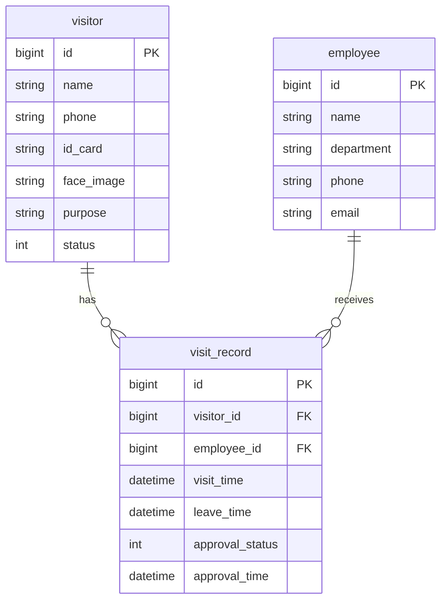
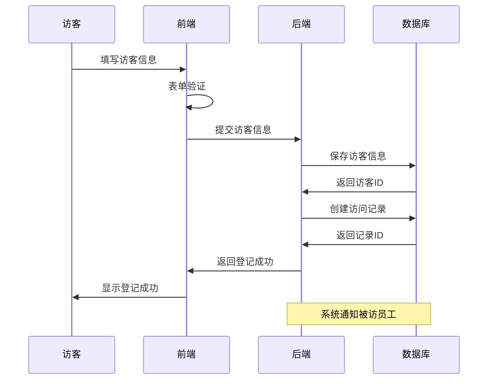

# 访客系统概要设计文档

## 1. 数据结构设计

### 1.1 访客信息表(visitor)
```sql
CREATE TABLE visitor (
    id BIGINT PRIMARY KEY AUTO_INCREMENT COMMENT '访客ID',
    name VARCHAR(50) NOT NULL COMMENT '访客姓名',
    phone VARCHAR(20) NOT NULL COMMENT '手机号',
    id_card VARCHAR(18) NOT NULL COMMENT '身份证号',
    face_image VARCHAR(200) COMMENT '人脸照片URL',
    purpose VARCHAR(200) NOT NULL COMMENT '来访目的',
    status TINYINT NOT NULL DEFAULT 0 COMMENT '状态(0待审批/1已通过/2已拒绝/3已过期)',
    create_time DATETIME NOT NULL COMMENT '创建时间',
    update_time DATETIME NOT NULL COMMENT '更新时间'
) COMMENT='访客信息表';
```

### 1.2 员工信息表(employee)
```sql
CREATE TABLE employee (
    id BIGINT PRIMARY KEY AUTO_INCREMENT COMMENT '员工ID',
    name VARCHAR(50) NOT NULL COMMENT '员工姓名',
    department VARCHAR(50) NOT NULL COMMENT '部门',
    phone VARCHAR(20) NOT NULL COMMENT '手机号',
    email VARCHAR(50) COMMENT '邮箱',
    create_time DATETIME NOT NULL COMMENT '创建时间',
    update_time DATETIME NOT NULL COMMENT '更新时间'
) COMMENT='员工信息表';
```

### 1.3 访问记录表(visit_record)
```sql
CREATE TABLE visit_record (
    id BIGINT PRIMARY KEY AUTO_INCREMENT COMMENT '记录ID',
    visitor_id BIGINT NOT NULL COMMENT '访客ID',
    employee_id BIGINT NOT NULL COMMENT '被访员工ID',
    visit_time DATETIME NOT NULL COMMENT '预计来访时间',
    leave_time DATETIME COMMENT '离开时间',
    approval_status TINYINT NOT NULL DEFAULT 0 COMMENT '审批状态(0待审批/1通过/2拒绝)',
    approval_time DATETIME COMMENT '审批时间',
    create_time DATETIME NOT NULL COMMENT '创建时间',
    FOREIGN KEY (visitor_id) REFERENCES visitor(id),
    FOREIGN KEY (employee_id) REFERENCES employee(id)
) COMMENT='访问记录表';
```

## 2. 实体关系图



## 3. 访客登记流程时序图



## 4. 核心接口设计

### 4.1 访客登记接口
- URL: `/api/visitor/register`
- Method: POST
```json
{
    "request": {
        "name": "string",
        "phone": "string",
        "idCard": "string",
        "faceImage": "string",
        "purpose": "string",
        "employeeId": "number",
        "visitTime": "datetime"
    },
    "response": {
        "code": 200,
        "message": "success",
        "data": {
            "visitorId": "number",
            "recordId": "number"
        }
    }
}
```

### 4.2 审批接口
- URL: `/api/visit/approve`
- Method: POST
```json
{
    "request": {
        "recordId": "number",
        "status": "number",
        "remark": "string"
    },
    "response": {
        "code": 200,
        "message": "success",
        "data": null
    }
}
```