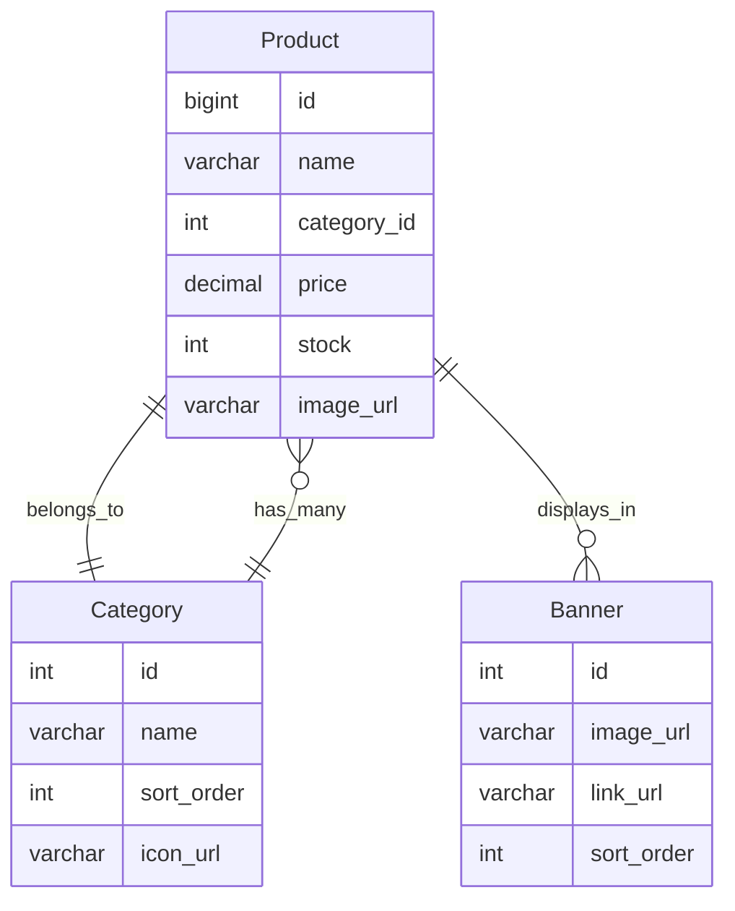
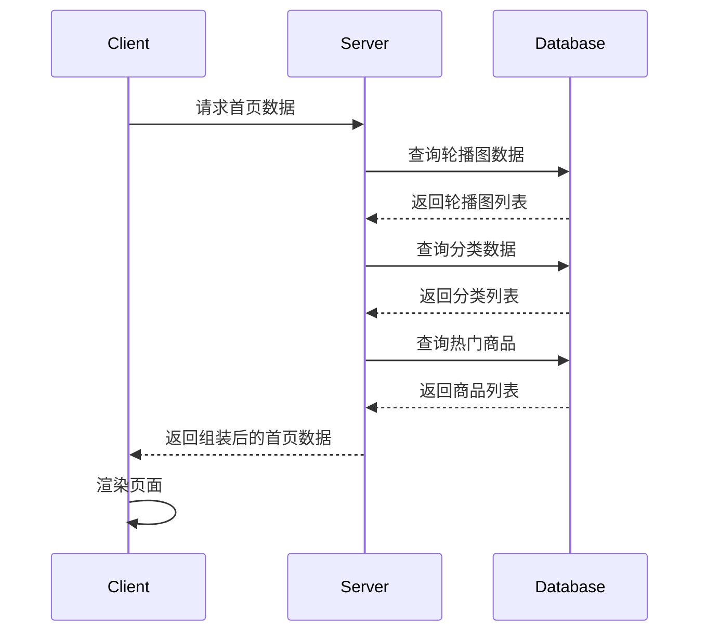

# 自行车销售网站概要设计文档

## 1. 数据结构设计

### 1.1 产品表(Product)
```sql
CREATE TABLE product (
    id BIGINT PRIMARY KEY AUTO_INCREMENT COMMENT '产品ID',
    name VARCHAR(100) NOT NULL COMMENT '产品名称',
    category_id INT NOT NULL COMMENT '分类ID',
    price DECIMAL(10,2) NOT NULL COMMENT '价格',
    stock INT NOT NULL COMMENT '库存',
    image_url VARCHAR(255) COMMENT '主图URL',
    description TEXT COMMENT '产品描述',
    status TINYINT DEFAULT 1 COMMENT '状态:1-上架,0-下架',
    created_at TIMESTAMP DEFAULT CURRENT_TIMESTAMP COMMENT '创建时间',
    updated_at TIMESTAMP DEFAULT CURRENT_TIMESTAMP ON UPDATE CURRENT_TIMESTAMP COMMENT '更新时间',
    FOREIGN KEY (category_id) REFERENCES category(id)
);
```

### 1.2 分类表(Category)
```sql
CREATE TABLE category (
    id INT PRIMARY KEY AUTO_INCREMENT COMMENT '分类ID',
    name VARCHAR(50) NOT NULL COMMENT '分类名称',
    sort_order INT DEFAULT 0 COMMENT '排序',
    icon_url VARCHAR(255) COMMENT '图标URL',
    status TINYINT DEFAULT 1 COMMENT '状态:1-启用,0-禁用'
);
```

### 1.3 轮播图表(Banner)
```sql
CREATE TABLE banner (
    id INT PRIMARY KEY AUTO_INCREMENT COMMENT '轮播图ID',
    image_url VARCHAR(255) NOT NULL COMMENT '图片URL',
    link_url VARCHAR(255) COMMENT '跳转链接',
    sort_order INT DEFAULT 0 COMMENT '排序',
    status TINYINT DEFAULT 1 COMMENT '状态:1-启用,0-禁用'
);
```

## 2. 实体关系图



## 3. 首页加载时序图



## 4. 核心接口设计

### 4.1 获取首页数据
```
GET /api/home/index

Response:
{
    "code": 200,
    "data": {
        "banners": [{
            "id": 1,
            "imageUrl": "string",
            "linkUrl": "string"
        }],
        "categories": [{
            "id": 1,
            "name": "string",
            "iconUrl": "string"
        }],
        "hotProducts": [{
            "id": 1,
            "name": "string",
            "price": 0.00,
            "imageUrl": "string"
        }]
    }
}
```

### 4.2 获取产品列表
```
GET /api/products

Parameters:
- categoryId: number
- page: number
- size: number

Response:
{
    "code": 200,
    "data": {
        "total": 100,
        "list": [{
            "id": 1,
            "name": "string",
            "price": 0.00,
            "imageUrl": "string",
            "stock": 0
        }]
    }
}
```