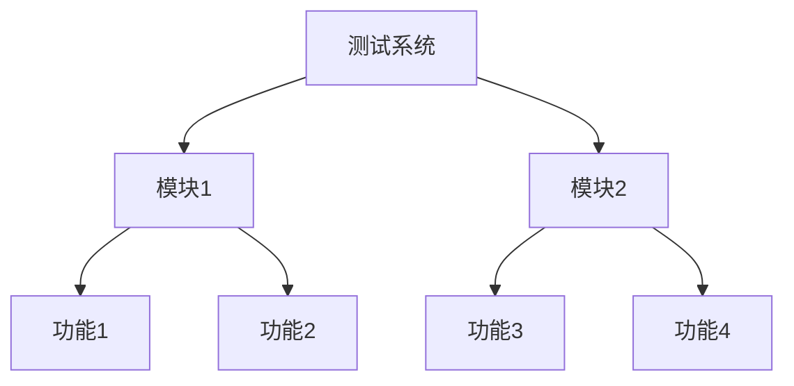

# 产品需求说明书 (PRD)

## 文档信息
- 文档版本：V1.0
- 创建日期：2024-01-01
- 作者：产品经理

## 1. 产品概述
### 1.1 产品背景
测试产品需求文档模板

### 1.2 目标用户
待补充

### 1.3 产品定位
待补充

## 2. 功能需求
### 2.1 核心功能
待补充

### 2.2 功能结构图


## 3. 产品原型
### 3.1 页面布局
```
+------------------+
|     Header       |
+------------------+
|                  |
|     Content      |
|                  |
+------------------+
|     Footer       |
+------------------+
```

## 4. 技术要求
### 4.1 系统环境
待补充

### 4.2 性能要求
待补充

## 5. 项目规划
### 5.1 开发周期
待补充

### 5.2 迭代计划
待补充

## 6. 附录
### 6.1 修订记录
| 版本 | 修订日期 | 修订说明 |
|-----|---------|---------|
| V1.0| 2024-01-01 | 初稿 |