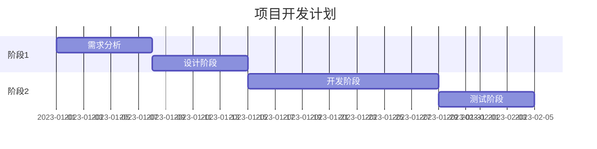

# 产品需求文档模板

## 文档信息

|文档信息|内容|
|----|----|
|文档标题|「请输入产品名称」产品需求说明书|
|版本号|V1.0|
|作者|PM|
|最后更新日期|YYYY-MM-DD|

## 1. 产品概述

### 1.1 产品背景

### 1.2 产品目标

### 1.3 产品定位

### 1.4 用户群体

## 2. 需求概述

### 2.1 核心需求

### 2.2 功能列表

```
- 功能模块1
  - 子功能1.1
  - 子功能1.2
- 功能模块2
  - 子功能2.1
  - 子功能2.2
```

## 3. 详细功能说明

### 3.1 功能模块1

#### 3.1.1 功能描述

#### 3.1.2 功能原型

```
+-------------+
|   Header    |
+-------------+
|             |
|   Content   |
|             |
+-------------+
|   Footer    |
+-------------+
```

#### 3.1.3 业务规则

#### 3.1.4 交互说明

### 3.2 功能模块2
(同上述结构)

## 4. 非功能需求

### 4.1 性能需求

### 4.2 安全需求

### 4.3 兼容性要求

## 5. 项目规划

### 5.1 开发排期



### 5.2 验收标准

## 6. 附录

### 6.1 术语表

### 6.2 修订记录

|版本号|修订日期|修订人|修订描述|
|----|----|----|----|
|V1.0|YYYY-MM-DD|PM|创建文档|