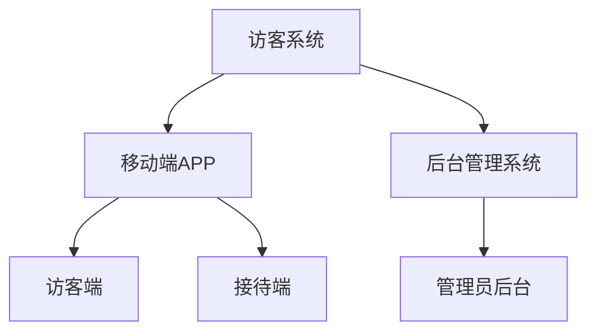

# 访客系统产品需求文档(PRD)

## 1. 文档信息

- 文档版本: v1.0
- 作者: AI助手
- 最后更新: 2024-01-01

## 2. 产品概述

### 2.1 产品背景
访客系统旨在提供一个现代化的访客管理解决方案，包含移动端APP和后台管理系统，用于管理访客登记、预约、通行等业务场景。

### 2.2 产品目标
- 提升访客登记效率
- 加强安全管理
- 优化访客体验
- 提供数据分析能力

## 3. 产品架构



## 4. 功能需求

### 4.1 移动端APP

#### 4.1.1 访客端功能
1. 访客预约
   - 在线预约申请
   - 填写访客信息
   - 上传证件照片
   - 选择访问时间
   - 选择被访人

2. 访客登记
   - 现场扫码登记
   - 人脸识别
   - 证件识别
   - 健康码关联

3. 通行管理
   - 电子通行证
   - 二维码通行
   - 访问路线导航
   - 到访提醒

#### 4.1.2 接待端功能
1. 访客审核
   - 预约审核
   - 现场审核
   - 快速通过
   - 拒绝处理

2. 访客管理
   - 访客信息查看
   - 访客状态更新
   - 异常情况处理
   - 紧急情况处理

### 4.2 后台管理系统

1. 系统配置
   - 角色权限管理
   - 部门管理
   - 用户管理
   - 访问规则配置

2. 访客管理
   - 访客记录查询
   - 黑名单管理
   - 访客统计分析
   - 异常记录处理

3. 数据分析
   - 访客流量分析
   - 访问时段分析
   - 部门访问统计
   - 报表导出

## 5. 原型设计

### 5.1 移动端APP主要流程

```
+----------------+     +----------------+     +----------------+
|   访客预约     |     |   身份验证     |     |   通行证展示   |
|                |     |                |     |                |
| [填写信息]     | --> | [扫描证件]     | --> | [二维码/证件]  |
| [选择时间]     |     | [人脸识别]     |     | [状态显示]    |
+----------------+     +----------------+     +----------------+
```

### 5.2 后台管理界面布局

```
+------------------------+------------------------+
|        Header          |        用户信息        |
+------------------------+------------------------+
|        |              访客统计面板             |
|  导航  |     [今日访客] [待审核] [异常记录]    |
|  菜单  |                                      |
|        |              数据列表                |
|        |     [搜索栏]                        |
|        |     [数据表格]                      |
+------------------------+------------------------+
```

## 6. 非功能需求

### 6.1 性能需求
- APP启动时间≤3秒
- 后台响应时间≤1秒
- 支持并发访问≥1000

### 6.2 安全需求
- 数据传输加密
- 敏感信息脱敏
- 访问权限控制
- 操作日志记录

### 6.3 可用性需求
- 系统可用性99.9%
- 7×24小时运行
- 故障恢复时间≤30分钟

## 7. 项目规划

### 7.1 开发周期
- 需求分析：2周
- 设计开发：8周
- 测试部署：2周
- 总周期：12周

### 7.2 迭代计划
1. 第一迭代：基础功能开发
2. 第二迭代：高级功能开发
3. 第三迭代：性能优化
4. 第四迭代：系统集成

## 8. 风险评估

| 风险点 | 影响程度 | 应对措施 |
|--------|----------|----------|
| 数据安全 | 高 | 加密传输、权限控制 |
| 系统稳定性 | 中 | 负载均衡、监控预警 |
| 用户体验 | 中 | 持续优化、收集反馈 |

## 9. 附录

### 9.1 术语说明
- 访客：外来人员
- 被访人：内部员工
- 通行证：电子或实体访问凭证

### 9.2 参考文档
- 《访客管理规范》
- 《安全管理制度》
- 《数据保护条例》