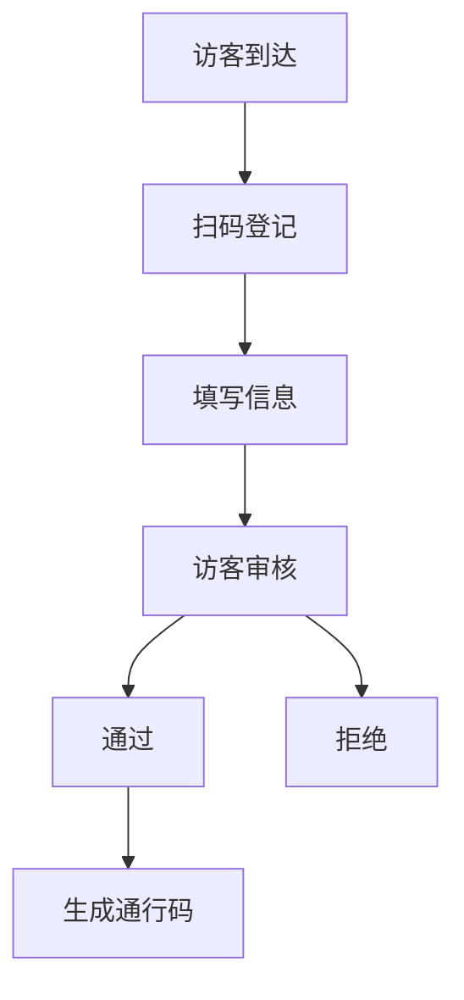

# 产品需求文档 (PRD)

## 文档信息
- 项目名称：小C访客系统
- 版本号：v1.0
- 作者：产品经理
- 最后更新：2024-01-01

## 1. 产品概述
### 1.1 产品背景
- 解决企业访客登记管理难题
- 提升访客登记效率和安全性
- 数字化企业访客管理流程

### 1.2 产品目标
- 实现访客信息快速录入和审核
- 提供访客轨迹追踪
- 实现访客数据统计分析

## 2. 功能需求
### 2.1 核心功能
#### 2.1.1 访客登记流程


#### 2.1.2 访客管理
- 访客信息录入
- 实时访客状态查看
- 访客权限管理
- 黑名单管理

### 2.2 数据统计
```
+------------------+
|    访客分析      |
+------------------+
|  商务  | 40%    |
|  面试  | 30%    |
|  私人  | 20%    |
|  其他  | 10%    |
+------------------+
```

## 3. 非功能需求
### 3.1 性能需求
- 系统响应时间 < 2秒
- 支持并发访问量 100+
- 访客数据实时同步

### 3.2 安全需求
- 访客信息加密存储
- 访问权限分级管理
- 敏感数据脱敏处理

## 4. 界面原型
### 4.1 访客登记界面
```
+-------------------+
|    访客登记      |
+-------------------+
| 姓名:_________    |
| 手机:_________    |
| 来访事由:______   |
| 受访人:________   |
+-------------------+
| [提交] [取消]     |
+-------------------+
```

## 5. 开发计划
### 5.1 迭代计划
1. v1.0 基础版本
   - 访客登记功能
   - 基础管理功能

2. v1.1 功能完善
   - 数据分析功能
   - 访客追踪功能

## 6. 风险评估
- 信息安全风险
- 系统稳定性
- 用户隐私保护
- 系统集成风险