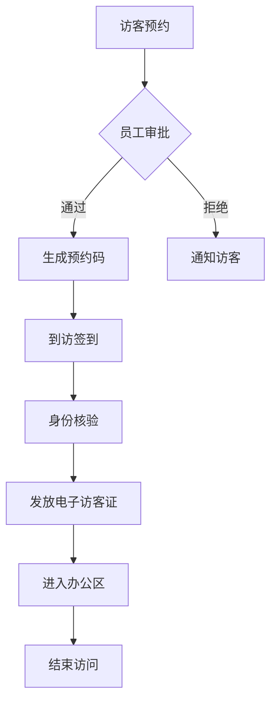

# 小鹏访客系统产品需求文档(PRD)

## 1. 产品概述

### 1.1 产品定义
小鹏访客系统是一套面向小鹏汽车办公场所的智能访客管理解决方案,用于规范化管理来访人员、提升访客体验和保障办公安全。

### 1.2 产品目标
- 提升访客登记效率
- 加强企业安全管控
- 优化访客体验
- 数字化访客数据管理

## 2. 需求背景

### 2.1 现状分析
- 人工登记效率低下
- 纸质记录难以统计追溯
- 访客流程不规范
- 安全管控存在漏洞

### 2.2 痛点问题
- 访客等待时间长
- 员工接待流程繁琐
- 临时访客难管理
- 数据分析能力弱

## 3. 功能需求

### 3.1 访客端
- 预约登记
  - 在线预约
  - 填写基本信息
  - 上传证件照片
- 到访签到
  - 扫码签到
  - 人脸识别
  - 健康码核验
- 访客证管理
  - 电子访客证
  - 有效期管理
  - 临时证件

### 3.2 员工端
- 访客预约审批
- 到访提醒
- 一键接待
- 访客信息查看

### 3.3 管理端
- 访客数据统计
- 黑名单管理
- 权限配置
- 系统设置

## 4. 交互流程

## 5. 验收标准

### 5.1 功能验收
- 预约登记功能完整可用
- 身份核验准确率>99%
- 系统响应时间<2秒
- 数据统计准确完整

### 5.2 性能验收
- 并发访客数≥100
- 系统稳定运行时间>99.9%
- 数据备份恢复机制完善

### 5.3 安全验收
- 访客信息加密存储
- 权限分级管理
- 操作日志完整记录
- 敏感数据脱敏处理

## 6. 非功能需求

### 6.1 技术要求
- 支持主流浏览器
- 移动端自适应
- 标准接口规范
- 分布式架构

### 6.2 安全要求
- 数据传输加密
- 访问权限控制
- 操作行为审计
- 防攻击措施

### 6.3 性能要求
- 页面加载<3秒
- 并发支持>1000
- 数据实时同步
- 7*24小时运行