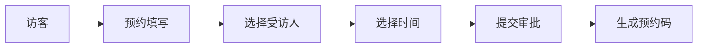
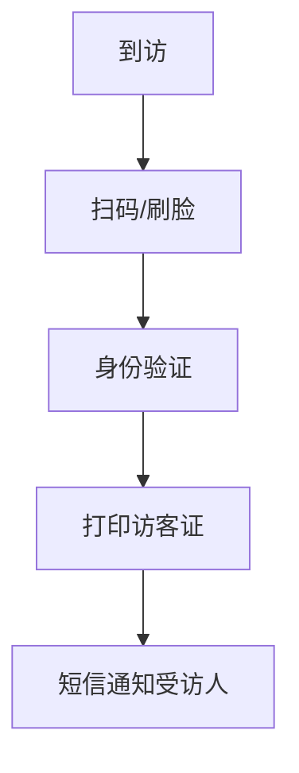

# 小鹏访客系统产品需求文档

## 1. 产品概述

### 1.1 产品背景
为提升小鹏汽车办公区域的安全管理水平，优化访客接待流程，建设智能化访客管理系统。

### 1.2 产品目标
- 提升访客登记效率
- 加强安全管控
- 优化访客体验
- 实现数据可追溯

## 2. 功能需求

### 2.1 访客预约


#### 2.1.1 基本信息填写
- 姓名
- 手机号
- 身份证号
- 来访目的
- 随行人数

#### 2.1.2 预约信息
- 受访部门
- 受访人
- 预约时间
- 预计离开时间

### 2.2 访客签到


### 2.3 访客管理
- 实时访客状态查看
- 访客记录查询
- 异常访客预警
- 访客黑名单管理

### 2.4 系统管理
- 用户权限管理
- 部门信息管理
- 系统配置管理
- 数据统计报表

## 3. 非功能需求

### 3.1 性能需求
- 系统响应时间 < 2s
- 并发访问量支持 1000+
- 7*24小时稳定运行

### 3.2 安全需求
- 数据传输加密
- 访客信息脱敏处理
- 定期数据备份
- 操作日志记录

### 3.3 兼容性需求
- 支持主流浏览器
- 移动端自适应

## 4. 界面原型

### 4.1 访客预约界面
```
+----------------------+
|    访客预约系统     |
+----------------------+
| 姓名: [          ]  |
| 手机: [          ]  |
| 身份证:[        ]   |
| 受访人:[选择    ▼]  |
| 时间: [日期选择  ]  |
| 目的: [          ]  |
+----------------------+
|     [提交预约]      |
+----------------------+
```

### 4.2 访客签到界面
```
+----------------------+
|    访客签到系统     |
+----------------------+
|                     |
|   【扫码区域】      |
|                     |
+----------------------+
|   【人脸识别】      |
+----------------------+
```

## 5. 项目实施

### 5.1 开发周期
- 需求分析：2周
- 系统设计：2周
- 开发实现：8周
- 测试部署：2周

### 5.2 项目风险
- 系统安全风险
- 数据准确性风险
- 用户适应性风险

## 6. 验收标准
- 功能完整性验收
- 性能指标验收
- 安全性验收
- 用户体验验收