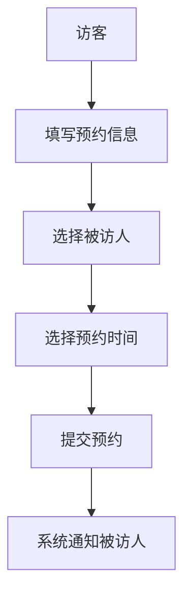
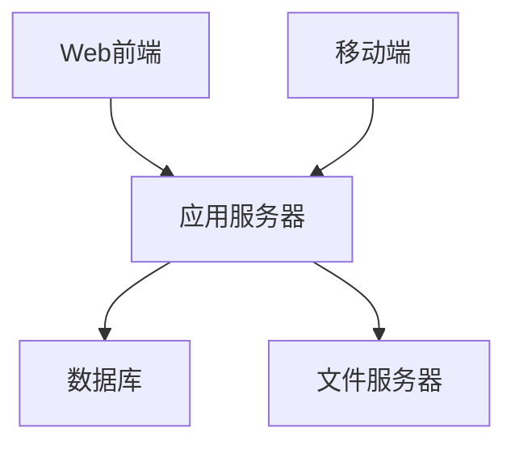

# 小鹏访客系统产品需求文档

## 1. 文档信息

| 文档信息 | 内容 |
|----------|------|
| 产品名称 | 小鹏访客系统 |
| 文档版本 | V1.0 |
| 作者 | PM |
| 最后更新日期 | 2024-01-18 |

## 2. 修订历史

| 版本号 | 修订日期 | 修订内容 | 修订人 |
|--------|----------|----------|--------|
| V1.0 | 2024-01-18 | 首次创建 | PM |

## 3. 需求概述

### 3.1 产品简介
小鹏访客系统是一款面向企业的访客管理系统，用于规范化管理来访人员，提高企业安全性和访客体验。

### 3.2 产品目标
- 提升访客登记效率
- 加强企业安全管理
- 优化访客体验
- 实现访客数据可追溯

## 4. 功能需求

### 4.1 访客预约


#### 4.1.1 预约信息包含
- 访客姓名
- 手机号码
- 来访目的
- 预计到访时间
- 预计离开时间
- 被访人信息

### 4.2 访客签到
- 身份证识别
- 人脸采集
- 健康码核验
- 电子访客单生成

### 4.3 访客管理
- 访客记录查询
- 访客状态跟踪
- 黑名单管理
- 访客统计报表

### 4.4 权限管理
- 系统管理员
- 前台接待
- 安保人员
- 被访人员

## 5. 非功能需求

### 5.1 性能需求
- 系统响应时间：<2秒
- 并发访问量：支持100人同时在线
- 数据备份：每日自动备份

### 5.2 安全需求
- 数据传输加密
- 访客信息脱敏处理
- 操作日志记录

## 6. 系统架构



## 7. 界面原型

### 7.1 访客预约界面
```
+-------------------+
|   访客预约系统    |
+-------------------+
| 姓名: [        ]  |
| 电话: [        ]  |
| 来访目的:[     ]  |
| 被访人:[选择 v ]  |
| 时间: [日期选择]  |
|                   |
| [提交预约] [取消] |
+-------------------+
```

### 7.2 访客签到界面
```
+-------------------+
|   访客签到系统    |
+-------------------+
|                   |
| [身份证识别区域]  |
|                   |
| [人脸采集区域]    |
|                   |
| [确认签到] [取消] |
+-------------------+
```

## 8. 迭代计划

### Phase 1 (2周)
- 访客预约基础功能
- 身份证识别
- 基础管理后台

### Phase 2 (2周)
- 人脸识别
- 电子访客单
- 统计报表

### Phase 3 (2周)
- 系统优化
- 移动端适配
- 安全性提升

## 9. 风险评估

| 风险点 | 影响程度 | 应对措施 |
|--------|----------|----------|
| 系统稳定性 | 高 | 做好负载测试和容灾备份 |
| 数据安全 | 高 | 实施严格的权限控制和加密措施 |
| 用户体验 | 中 | 进行充分的用户测试和反馈收集 |

## 10. 验收标准

- 访客预约成功率 > 99%
- 系统可用性 > 99.9%
- 用户满意度 > 90%
- 数据准确率 100%