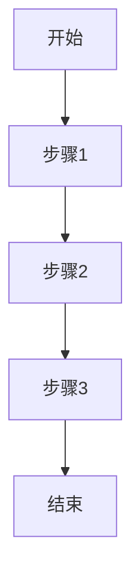

# 产品需求文档(PRD)
## 文档信息

| 信息 | 内容 |
|------|------|
| 文档状态 | 待输入 |
| 文档版本 | v0.1 |
| 作者 | 待输入 |
| 创建日期 | 待输入 |

## 1. 需求背景
(请描述项目背景和业务价值)

## 2. 目标用户
(请描述目标用户画像)

## 3. 功能需求
### 3.1 核心功能
- 功能点1
- 功能点2
- 功能点3

### 3.2 功能详述
#### 3.2.1 功能模块1
**功能描述**:
```
待输入具体功能描述
```

**业务流程**:


**原型图**:
```
+------------------+
|    Header        |
+------------------+
|                  |
|     Content      |
|                  |
+------------------+
|    Footer        |
+------------------+
```

## 4. 非功能需求
### 4.1 性能需求
- 性能指标1
- 性能指标2

### 4.2 安全需求
- 安全要求1
- 安全要求2

## 5. 验收标准
- [ ] 验收项1
- [ ] 验收项2
- [ ] 验收项3

## 6. 附录
### 6.1 术语表
| 术语 | 解释 |
|------|------|
| 待补充 | 待补充 |

### 6.2 参考文档
1. 参考文档1
2. 参考文档2