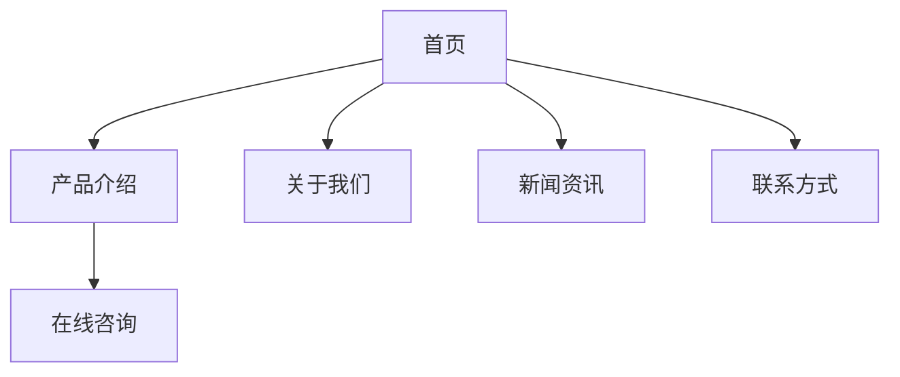

# 产品需求文档 (PRD)

## 文档信息
- 项目名称：小K官网
- 版本号：v1.0
- 作者：产品经理
- 最后更新：2024-01-01

## 1. 产品概述
### 1.1 产品背景
- 建立品牌官方形象
- 展示产品和服务信息
- 提供在线客户服务渠道

### 1.2 产品目标
- 提升品牌知名度
- 增加用户转化率
- 优化用户体验

## 2. 功能需求
### 2.1 核心功能
#### 2.1.1 网站结构


#### 2.1.2 内容管理
- 产品展示模块
- 新闻资讯发布
- 在线咨询系统
- 表单提交功能

### 2.2 页面布局
```
+------------------+
|      Header      |
+------------------+
|    Banner区域    |
+------------------+
|    产品展示      |
+------------------+
|    新闻资讯      |
+------------------+
|    Footer       |
+------------------+
```

## 3. 非功能需求
### 3.1 性能需求
- 页面加载时间 < 3秒
- 支持主流浏览器
- 响应式设计适配

### 3.2 安全需求
- SSL证书加密
- 防XSS攻击
- 数据备份机制

## 4. 界面原型
### 4.1 首页布局
```
+-------------------+
|  Logo   导航菜单  |
+-------------------+
|    轮播Banner    |
+-------------------+
|    产品展示      |
|   [图片] [图片]   |
|   [图片] [图片]   |
+-------------------+
|    联系我们      |
+-------------------+
```

## 5. 开发计划
### 5.1 迭代计划
1. v1.0 基础版本
   - 官网框架搭建
   - 基础页面开发

2. v1.1 功能完善
   - SEO优化
   - 性能优化

## 6. 风险评估
- 网站安全风险
- 服务器稳定性
- 内容维护成本
- 用户体验问题

## 7. 运营规划
- 定期内容更新
- 访问数据分析
- SEO策略优化
- 用户反馈收集