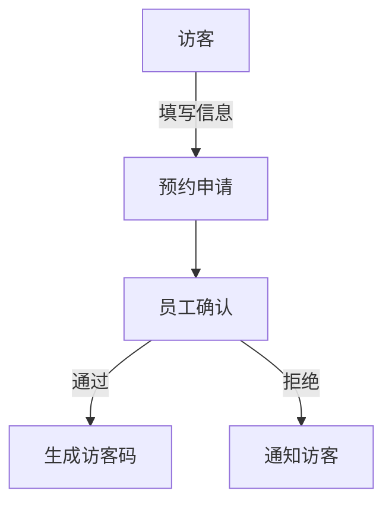

# 小a汽车访客系统产品需求文档

## 1. 文档信息

- 文档版本：V1.0
- 创建时间：2025-01-20
- 产品负责人：PM

## 2. 产品概述

### 2.1 产品背景
为提升小a汽车园区的安全管理水平，规范访客管理流程，开发访客系统。

### 2.2 产品目标
- 提升园区安全性
- 简化访客登记流程
- 实现访客数据可追溯
- 提高门卫工作效率

## 3. 功能需求

### 3.1 访客预约
- 访客在线预约
- 员工预约访客
- 预约信息确认



### 3.2 访客登记
- 身份证识别
- 车牌识别
- 人脸采集
- 访问目的登记

### 3.3 门禁管理
- 二维码验证
- 人脸验证
- 临时卡管理

### 3.4 来访管理
- 实时访客状态
- 访问时长统计
- 异常行为预警

## 4. 系统界面

### 4.1 访客预约界面
```
+----------------------+
|     访客预约系统     |
+----------------------+
| □ 访客信息          |
| □ 来访时间          |
| □ 来访事由          |
| □ 被访人信息        |
+----------------------+
|      提交预约        |
+----------------------+
```

### 4.2 门卫管理界面
```
+----------------------+
|   门卫管理工作台     |
+----------------------+
| 待处理预约  [10]    |
| 在访人员   [05]     |
| 超时预警   [02]     |
+----------------------+
```

## 5. 非功能需求

### 5.1 性能需求
- 系统响应时间≤2秒
- 支持并发访问≥100人
- 7*24小时稳定运行

### 5.2 安全需求
- 数据加密存储
- 访客信息脱敏
- 操作日志记录

## 6. 项目规划

### 6.1 开发周期
- 阶段一：需求分析（1周）
- 阶段二：系统开发（6周）
- 阶段三：测试上线（2周）

### 6.2 迭代计划
1. MVP版本：基础预约、登记功能
2. V1.1：门禁系统对接
3. V1.2：统计分析功能

## 7. 风险评估

- 系统稳定性风险
- 数据安全风险
- 用户适应性风险