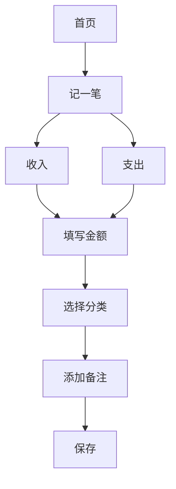

# 产品需求文档 (PRD)

## 文档信息
- 项目名称：小型个人记账本
- 版本号：v1.0
- 作者：产品经理
- 最后更新：2024-01-01

## 1. 产品概述
### 1.1 产品背景
- 针对个人日常收支记录需求
- 解决传统纸质记账不便携、容易丢失的问题

### 1.2 产品目标
- 提供简单易用的移动端记账功能
- 支持基础收支记录和统计分析
- 保障用户数据安全

## 2. 功能需求
### 2.1 核心功能
#### 2.1.1 记账功能


#### 2.1.2 账单管理
- 支持按日/周/月/年查看账单
- 支持账单编辑、删除
- 支持账单导出

### 2.2 数据统计
```
+----------------+
|    支出分析    |
+----------------+
|  饮食  | 30%  |
|  交通  | 20%  |
|  购物  | 25%  |
|  其他  | 25%  |
+----------------+
```

## 3. 非功能需求
### 3.1 性能需求
- 应用启动时间 < 3秒
- 数据保存响应时间 < 1秒

### 3.2 安全需求
- 支持指纹/面容解锁
- 本地数据加密存储

## 4. 界面原型
### 4.1 首页布局
```
+-----------------+
|    记账本     |
+-----------------+
| + 记一笔      |
|-----------------+
| 今日支出: ¥50  |
| 本月支出: ¥1500|
+-----------------+
| [收支明细列表] |
|  餐饮 -30      |
|  交通 -20      |
+-----------------+
```

## 5. 开发计划
### 5.1 迭代计划
1. v1.0 基础版本
   - 基础记账功能
   - 收支明细查看

2. v1.1 功能完善
   - 数据统计分析
   - 导出功能

## 6. 风险评估
- 数据安全风险
- 用户隐私保护
- 系统稳定性