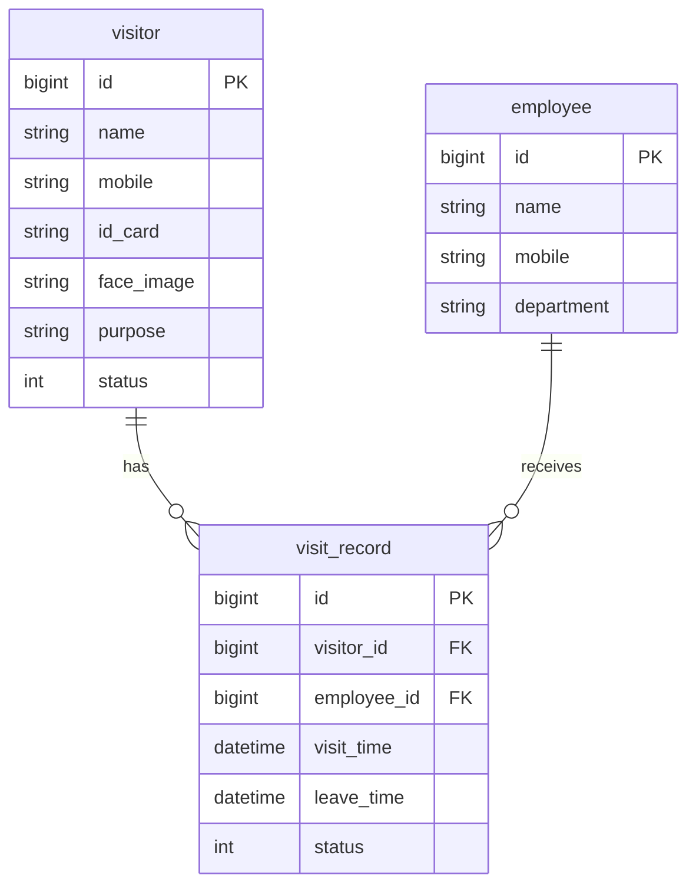
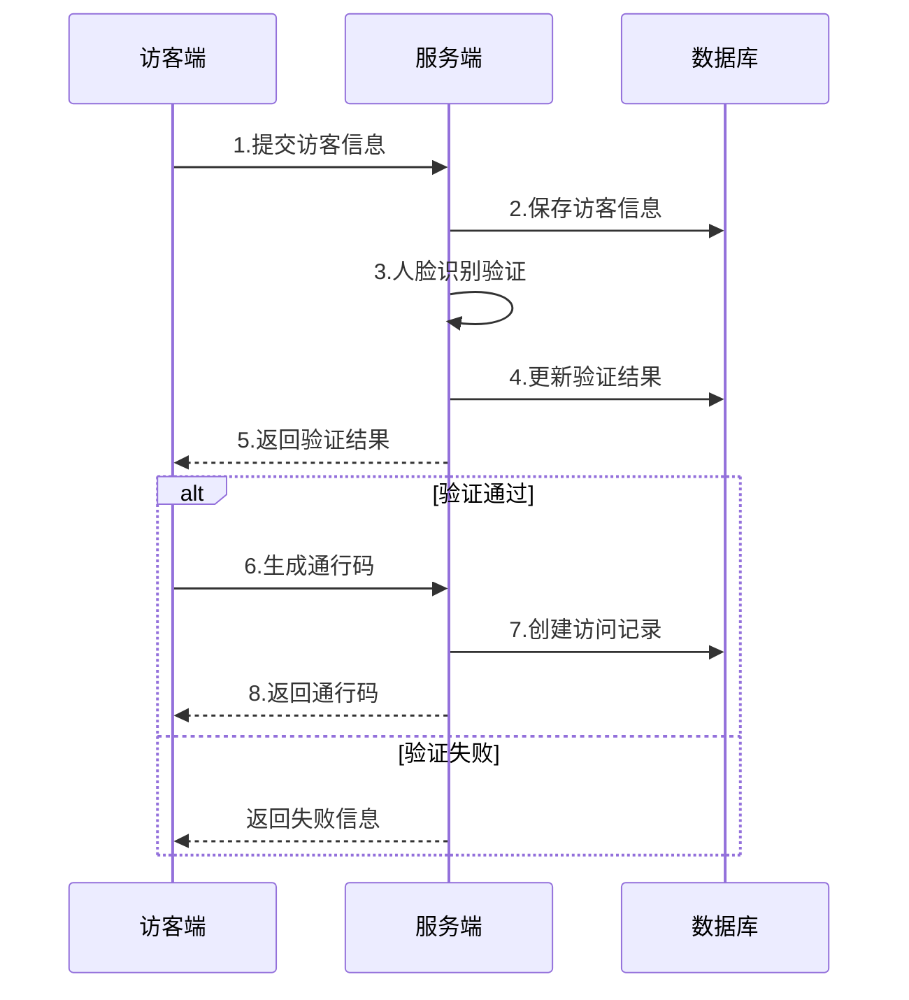

# 访客系统概要设计文档

## 1. 数据结构设计

### 1.1 访客信息表(visitor)
```sql
CREATE TABLE visitor (
    id BIGINT PRIMARY KEY AUTO_INCREMENT COMMENT '访客ID',
    name VARCHAR(50) NOT NULL COMMENT '访客姓名',
    mobile VARCHAR(20) NOT NULL COMMENT '手机号',
    id_card VARCHAR(18) NOT NULL COMMENT '身份证号',
    face_image VARCHAR(200) COMMENT '人脸照片地址',
    purpose VARCHAR(200) NOT NULL COMMENT '来访目的',
    status TINYINT NOT NULL DEFAULT 0 COMMENT '状态:0待审核,1已通过,2已拒绝',
    create_time DATETIME NOT NULL COMMENT '创建时间',
    update_time DATETIME NOT NULL COMMENT '更新时间',
    UNIQUE KEY uk_mobile (mobile),
    UNIQUE KEY uk_id_card (id_card)
) ENGINE=InnoDB DEFAULT CHARSET=utf8mb4 COMMENT='访客信息表';
```

### 1.2 员工信息表(employee)
```sql
CREATE TABLE employee (
    id BIGINT PRIMARY KEY AUTO_INCREMENT COMMENT '员工ID',
    name VARCHAR(50) NOT NULL COMMENT '员工姓名',
    mobile VARCHAR(20) NOT NULL COMMENT '手机号',
    department VARCHAR(50) NOT NULL COMMENT '部门',
    create_time DATETIME NOT NULL COMMENT '创建时间',
    UNIQUE KEY uk_mobile (mobile)
) ENGINE=InnoDB DEFAULT CHARSET=utf8mb4 COMMENT='员工信息表';
```

### 1.3 访问记录表(visit_record)
```sql
CREATE TABLE visit_record (
    id BIGINT PRIMARY KEY AUTO_INCREMENT COMMENT '记录ID',
    visitor_id BIGINT NOT NULL COMMENT '访客ID',
    employee_id BIGINT NOT NULL COMMENT '被访员工ID',
    visit_time DATETIME NOT NULL COMMENT '来访时间',
    leave_time DATETIME COMMENT '离开时间',
    status TINYINT NOT NULL DEFAULT 0 COMMENT '状态:0在访,1已离开',
    FOREIGN KEY (visitor_id) REFERENCES visitor(id),
    FOREIGN KEY (employee_id) REFERENCES employee(id)
) ENGINE=InnoDB DEFAULT CHARSET=utf8mb4 COMMENT='访问记录表';
```

## 2. 实体关系图



## 3. 访客登记流程图



## 4. 核心API接口设计

### 4.1 访客登记
```
POST /api/visitor/register
Request:
{
    "name": "string",
    "mobile": "string",
    "idCard": "string",
    "faceImage": "string",
    "purpose": "string",
    "employeeId": "long"
}
Response:
{
    "code": 200,
    "message": "success",
    "data": {
        "visitorId": "long",
        "status": "int"
    }
}
```

### 4.2 通行码生成
```
POST /api/visitor/pass-code/{visitorId}
Response:
{
    "code": 200,
    "message": "success",
    "data": {
        "passCode": "string",
        "expireTime": "datetime"
    }
}
```

### 4.3 访问记录查询
```
GET /api/visit/records
Params:
    visitorId: long
    employeeId: long
    startTime: datetime
    endTime: datetime
Response:
{
    "code": 200,
    "message": "success",
    "data": [{
        "recordId": "long",
        "visitorName": "string",
        "employeeName": "string",
        "visitTime": "datetime",
        "leaveTime": "datetime",
        "status": "int"
    }]
}
```