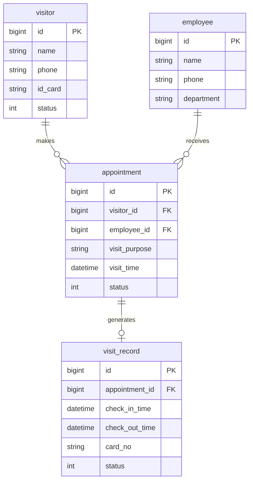
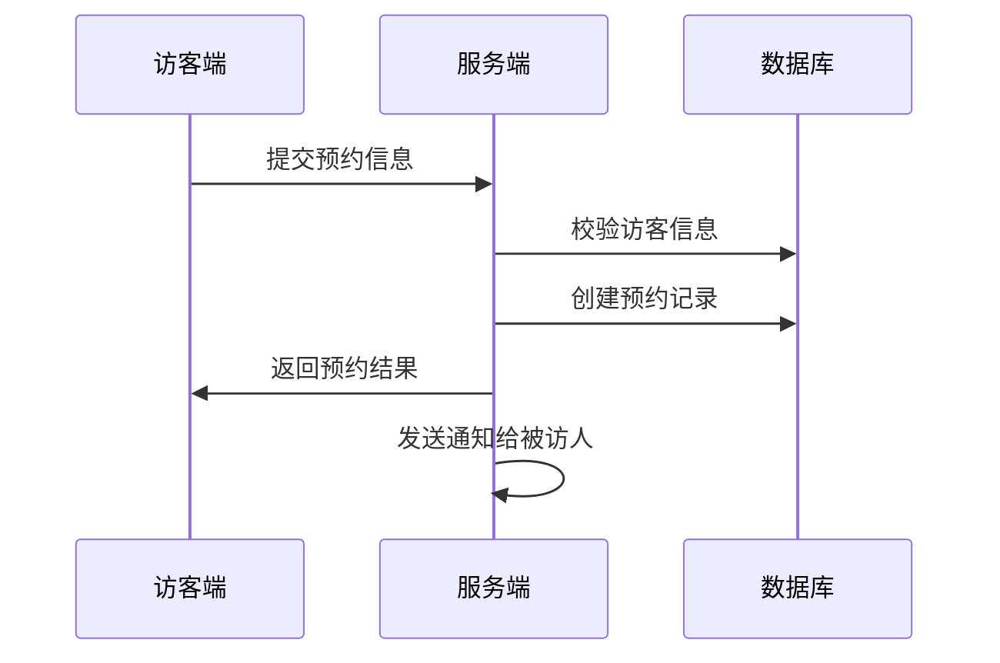
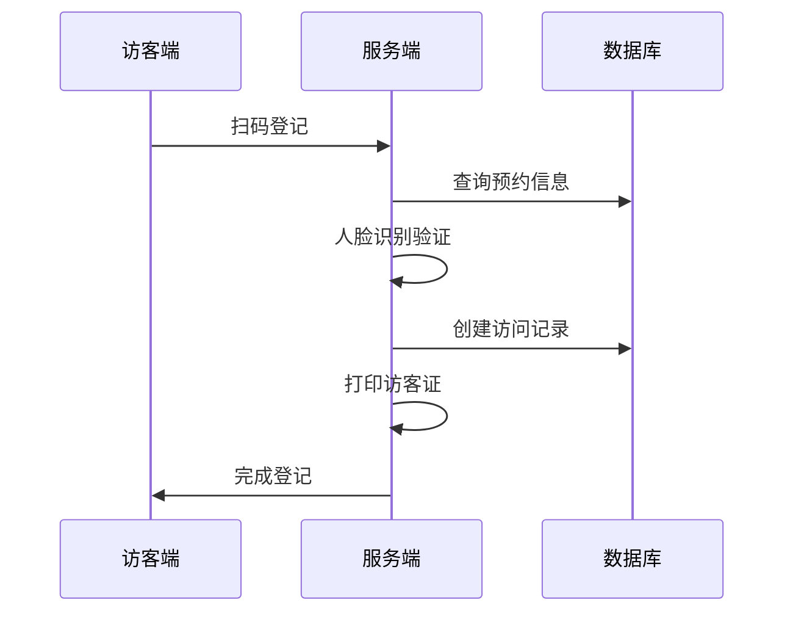

# 访客系统概要设计文档

## 1. 数据结构设计

### 1.1 访客表(visitor)
```sql
CREATE TABLE visitor (
    id BIGINT PRIMARY KEY AUTO_INCREMENT COMMENT '主键ID',
    name VARCHAR(50) NOT NULL COMMENT '访客姓名',
    phone VARCHAR(20) NOT NULL COMMENT '手机号',
    id_card VARCHAR(18) NOT NULL COMMENT '身份证号',
    status TINYINT NOT NULL DEFAULT 0 COMMENT '状态(0-正常 1-黑名单)',
    created_at DATETIME NOT NULL COMMENT '创建时间',
    updated_at DATETIME NOT NULL COMMENT '更新时间'
) COMMENT='访客信息表';
```

### 1.2 预约表(appointment)
```sql
CREATE TABLE appointment (
    id BIGINT PRIMARY KEY AUTO_INCREMENT COMMENT '主键ID',
    visitor_id BIGINT NOT NULL COMMENT '访客ID',
    employee_id BIGINT NOT NULL COMMENT '被访人ID',
    visit_purpose VARCHAR(200) NOT NULL COMMENT '来访目的',
    visit_time DATETIME NOT NULL COMMENT '预约来访时间',
    status TINYINT NOT NULL COMMENT '状态(0-待审核 1-已确认 2-已取消)',
    created_at DATETIME NOT NULL COMMENT '创建时间',
    updated_at DATETIME NOT NULL COMMENT '更新时间',
    FOREIGN KEY (visitor_id) REFERENCES visitor(id),
    FOREIGN KEY (employee_id) REFERENCES employee(id)
) COMMENT='访客预约表';
```

### 1.3 员工表(employee)
```sql
CREATE TABLE employee (
    id BIGINT PRIMARY KEY AUTO_INCREMENT COMMENT '主键ID',
    name VARCHAR(50) NOT NULL COMMENT '员工姓名',
    phone VARCHAR(20) NOT NULL COMMENT '手机号',
    department VARCHAR(50) NOT NULL COMMENT '部门',
    created_at DATETIME NOT NULL COMMENT '创建时间',
    updated_at DATETIME NOT NULL COMMENT '更新时间'
) COMMENT='员工信息表';
```

### 1.4 访问记录表(visit_record)
```sql
CREATE TABLE visit_record (
    id BIGINT PRIMARY KEY AUTO_INCREMENT COMMENT '主键ID',
    appointment_id BIGINT NOT NULL COMMENT '预约ID',
    check_in_time DATETIME COMMENT '进入时间',
    check_out_time DATETIME COMMENT '离开时间',
    card_no VARCHAR(50) COMMENT '访客证号',
    status TINYINT NOT NULL COMMENT '状态(0-进行中 1-已结束)',
    created_at DATETIME NOT NULL COMMENT '创建时间',
    updated_at DATETIME NOT NULL COMMENT '更新时间',
    FOREIGN KEY (appointment_id) REFERENCES appointment(id)
) COMMENT='访问记录表';
```

## 2. 实体关系图



## 3. 核心流程时序图

### 3.1 访客预约流程


### 3.2 来访登记流程


## 4. 关键接口设计

### 4.1 访客预约接口
```
POST /api/v1/appointments

Request:
{
    "visitorName": "string",    // 访客姓名
    "visitorPhone": "string",   // 访客手机号
    "visitorIdCard": "string",  // 访客身份证号
    "employeeId": "number",     // 被访人ID
    "visitPurpose": "string",   // 来访目的
    "visitTime": "datetime"     // 预约时间
}

Response:
{
    "code": 200,
    "data": {
        "appointmentId": "number"  // 预约ID
    }
}
```

### 4.2 访客登记接口
```
POST /api/v1/visits/check-in

Request:
{
    "appointmentId": "number",  // 预约ID
    "faceImage": "string"       // 人脸图片base64
}

Response:
{
    "code": 200,
    "data": {
        "visitId": "number",    // 访问记录ID
        "cardNo": "string"      // 访客证号
    }
}
```

### 4.3 访客离场接口
```
POST /api/v1/visits/check-out

Request:
{
    "visitId": "number",   // 访问记录ID
    "cardNo": "string"     // 访客证号
}

Response:
{
    "code": 200,
    "data": {
        "checkOutTime": "datetime"  // 离场时间
    }
}
```