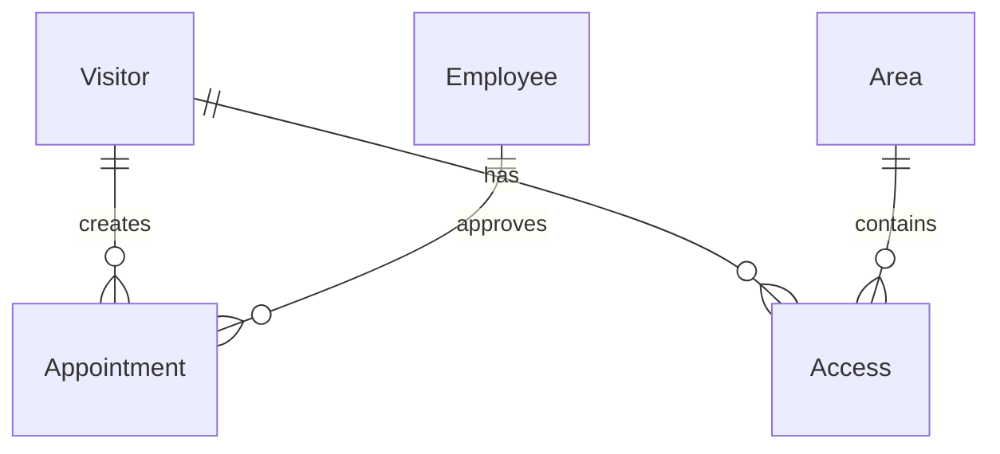
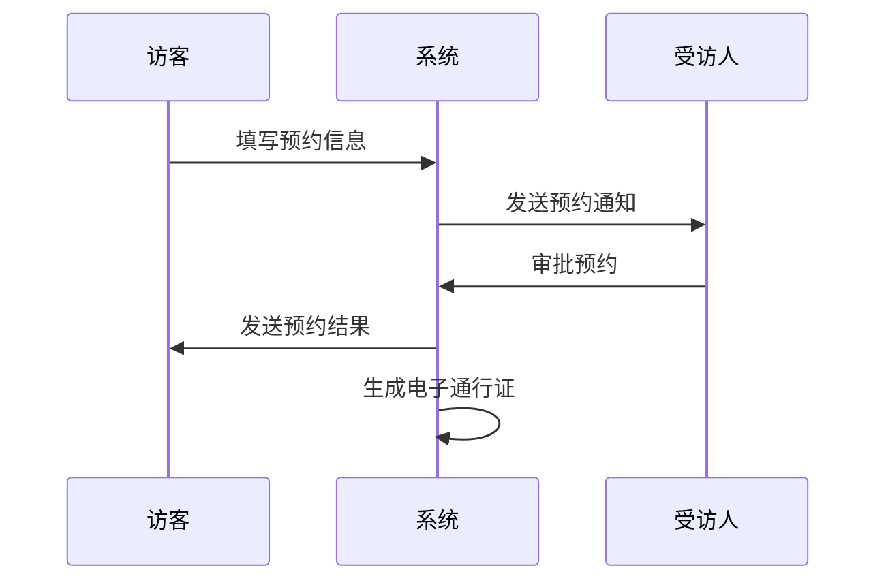
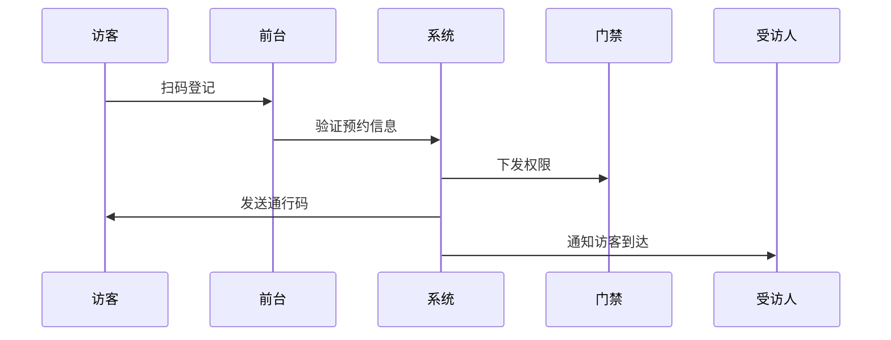

# 小鹏访客系统概要设计文档

## 1. 数据模型设计

### 1.1 核心实体

```sql
# 访客信息(Visitor)
- visitor_id: string (PK)
- name: string
- phone: string
- id_card: string
- company: string
- status: int

# 预约记录(Appointment)
- appointment_id: string (PK)
- visitor_id: string (FK)
- host_id: string (FK) 
- visit_time: datetime
- leave_time: datetime
- purpose: string
- status: int

# 员工信息(Employee)
- employee_id: string (PK)
- name: string
- phone: string
- department: string
- email: string

# 通行记录(Access)
- access_id: string (PK)
- visitor_id: string (FK)
- area_id: string (FK)
- access_time: datetime
- access_type: int
```

### 1.2 实体关系图(ER)



## 2. 核心流程时序图

### 2.1 访客预约流程



### 2.2 访客登记流程



## 3. 接口设计

### 3.1 API接口
```yaml
/api/v1/appointment:
  post:
    summary: 创建预约
  get:
    summary: 查询预约

/api/v1/visitor:
  post:
    summary: 访客登记
  get:
    summary: 查询访客信息
```

### 3.2 外部系统接口
- 门禁系统接口
- 短信通知接口
- 停车场系统接口

## 4. 技术架构

### 4.1 系统架构图
```
前端层: Vue + Element UI
服务层: Spring Boot
数据层: MySQL + Redis
```

### 4.2 部署架构
```
负载均衡 -> 应用服务器集群 -> 数据库主从
```

## 5. 安全方案

- 数据传输: HTTPS + JWT
- 数据存储: AES加密
- 访问控制: RBAC权限模型

## 6. 性能设计

- 读写分离
- 分布式缓存
- 消息队列解耦