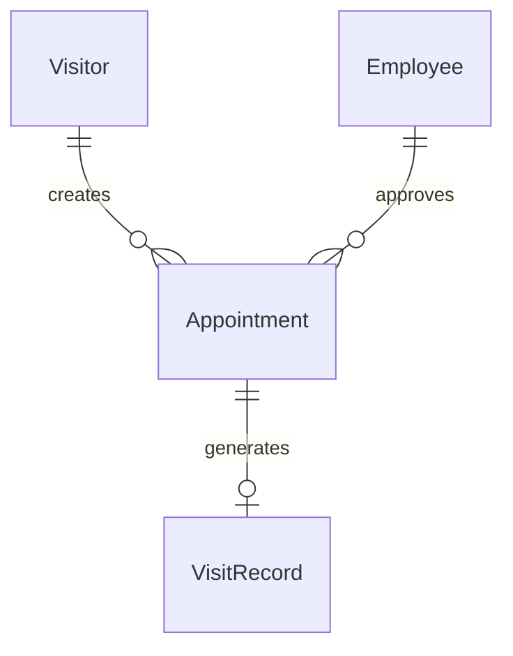
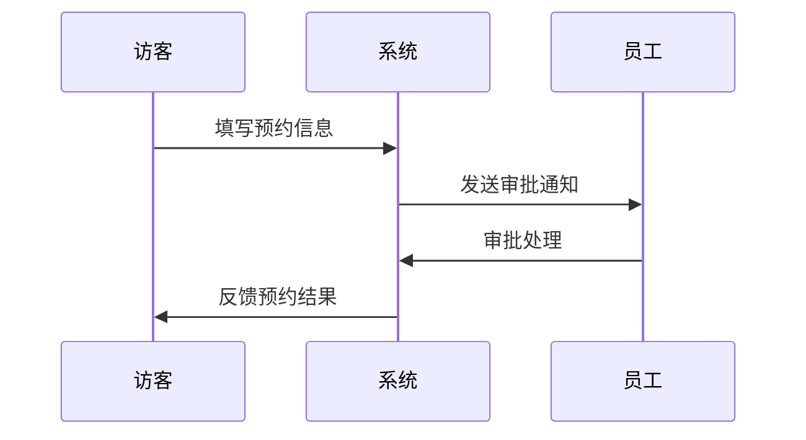
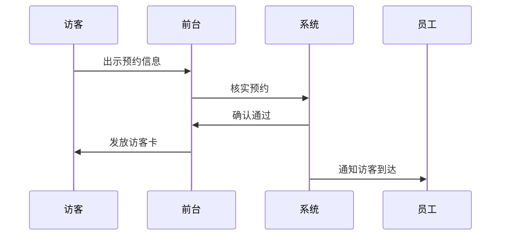
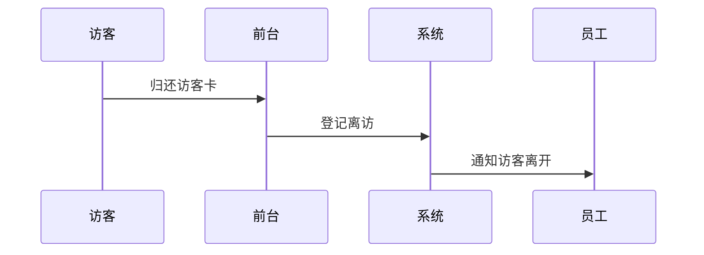

# 小鹏访客管理系统概要设计文档

## 1. 数据建模

### 1.1 核心实体

```sql
// 访客信息
Visitor {
  id: string (PK)
  name: string  
  phone: string
  idCard: string
  company: string
  visitPurpose: string
  status: int  // 0-待审批 1-已通过 2-已拒绝 3-已结束
  createTime: datetime
  updateTime: datetime
}

// 预约信息
Appointment {
  id: string (PK)
  visitorId: string (FK)
  employeeId: string (FK)  
  visitStartTime: datetime
  visitEndTime: datetime
  visitArea: string[]
  status: int // 0-待审批 1-已通过 2-已拒绝
  createTime: datetime
  updateTime: datetime
}

// 员工信息 
Employee {
  id: string (PK)
  name: string
  phone: string
  email: string
  department: string
  building: string
}

// 访问记录
VisitRecord {
  id: string (PK) 
  appointmentId: string (FK)
  actualStartTime: datetime
  actualEndTime: datetime
  status: int // 0-未到访 1-已到访 2-已结束
  createTime: datetime
  updateTime: datetime
}
```

## 2. 实体关系图



## 3. 核心流程时序图

### 3.1 访客预约流程 


### 3.2 来访登记流程


### 3.3 离访登记流程


## 4. 接口设计

### 4.1 访客接口
```
POST /api/visitor/register      // 访客注册
POST /api/visitor/appointment   // 预约申请
GET  /api/visitor/status       // 查询状态
```

### 4.2 员工接口
```
POST /api/employee/approve     // 审批处理
GET  /api/employee/appointments // 获取待审批列表
```

### 4.3 前台接口
```
POST /api/reception/checkin   // 来访登记
POST /api/reception/checkout  // 离访登记
GET  /api/reception/records   // 查询记录
```