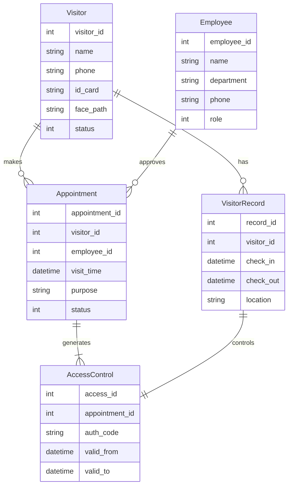
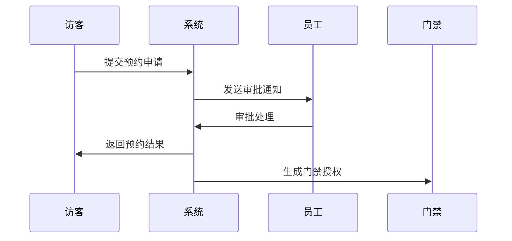
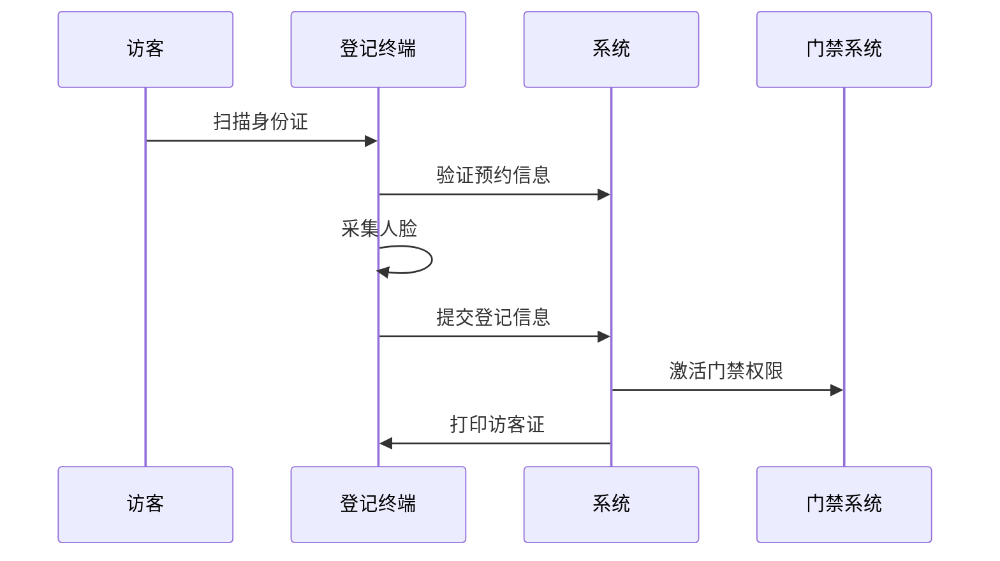

# 小鹏访客系统概要设计文档

## 1. 系统架构

### 1.1 总体架构
```
+----------------+    +----------------+    +----------------+
|   访客端API    |    |   员工端API    |    |   管理端API    |
+----------------+    +----------------+    +----------------+
         |                   |                    |
         +-------------------+--------------------+
                            |
                    +----------------+
                    |  业务服务层     |
                    +----------------+
                            |
                    +----------------+
                    |   数据存储层    |
                    +----------------+
```

## 2. 数据建模

### 2.1 实体关系图


### 2.2 数据库表结构
[核心表结构设计]

## 3. 关键流程

### 3.1 访客预约流程


### 3.2 访客登记流程


## 4. 接口设计

### 4.1 API接口列表
- /api/visitor/appointment
- /api/visitor/register
- /api/employee/approve
- /api/access/verify
[详细接口文档]

## 5. 安全设计

### 5.1 数据安全
- 传输加密：TLS 1.2
- 存储加密：AES-256
- 访问控制：RBAC模型

### 5.2 身份认证
- JWT令牌
- 生物特征认证
- 动态授权码

## 6. 部署架构

### 6.1 系统部署图
[部署架构图]