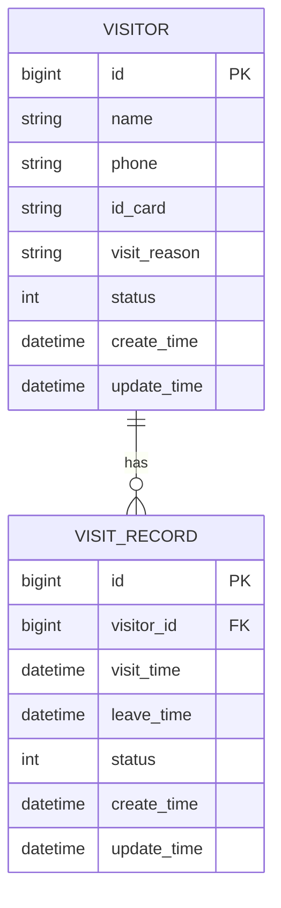
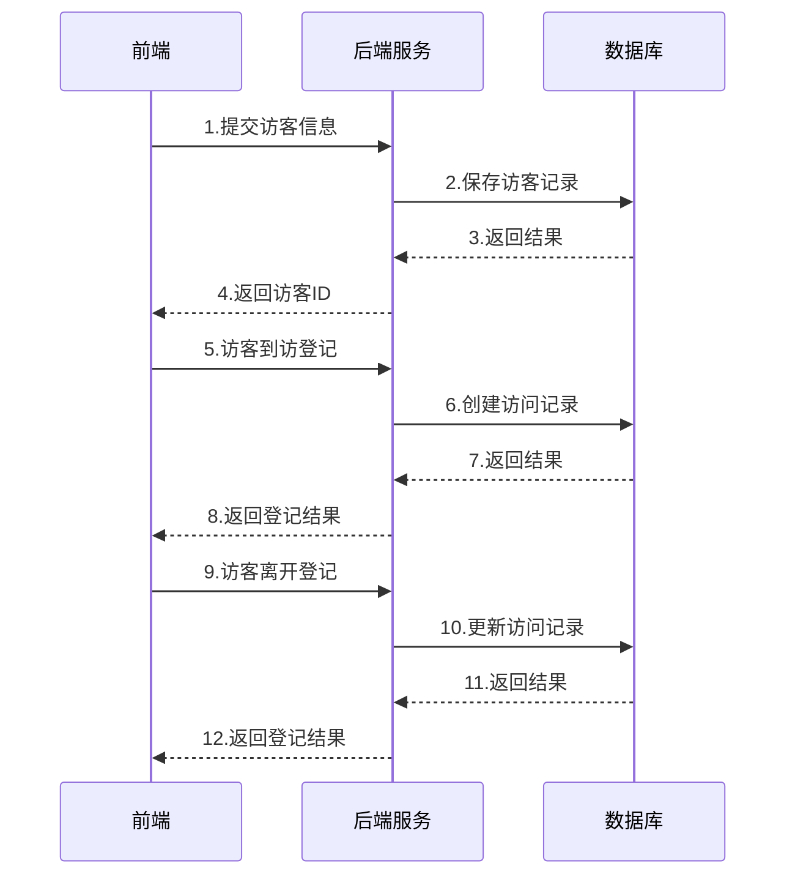

# 访客系统概要设计文档

## 1. 数据结构设计

### 1.1 访客信息表(visitor)
```sql
CREATE TABLE `visitor` (
  `id` bigint(20) NOT NULL AUTO_INCREMENT COMMENT '主键ID',
  `name` varchar(50) NOT NULL COMMENT '访客姓名',
  `phone` varchar(20) NOT NULL COMMENT '手机号码',
  `id_card` varchar(18) NOT NULL COMMENT '身份证号',
  `visit_reason` varchar(200) NOT NULL COMMENT '来访事由',
  `status` tinyint(4) NOT NULL DEFAULT '0' COMMENT '状态(0-待审核 1-已通过 2-已拒绝)',
  `create_time` datetime NOT NULL COMMENT '创建时间',
  `update_time` datetime NOT NULL COMMENT '更新时间',
  PRIMARY KEY (`id`),
  KEY `idx_phone` (`phone`)
) ENGINE=InnoDB DEFAULT CHARSET=utf8mb4 COMMENT='访客信息表';
```

### 1.2 访问记录表(visit_record) 
```sql
CREATE TABLE `visit_record` (
  `id` bigint(20) NOT NULL AUTO_INCREMENT COMMENT '主键ID',
  `visitor_id` bigint(20) NOT NULL COMMENT '访客ID',
  `visit_time` datetime NOT NULL COMMENT '来访时间',
  `leave_time` datetime DEFAULT NULL COMMENT '离开时间',
  `status` tinyint(4) NOT NULL DEFAULT '0' COMMENT '状态(0-进行中 1-已结束)',
  `create_time` datetime NOT NULL COMMENT '创建时间',
  `update_time` datetime NOT NULL COMMENT '更新时间',
  PRIMARY KEY (`id`),
  KEY `idx_visitor_id` (`visitor_id`),
  CONSTRAINT `fk_visit_record_visitor` FOREIGN KEY (`visitor_id`) REFERENCES `visitor` (`id`)
) ENGINE=InnoDB DEFAULT CHARSET=utf8mb4 COMMENT='访问记录表';
```

## 2. 实体关系图



## 3. 核心流程时序图



## 4. 关键接口设计

### 4.1 访客登记接口
```
POST /api/visitor/register

Request:
{
    "name": "张三",
    "phone": "13800138000",
    "idCard": "110101199001011234",
    "visitReason": "商务洽谈"
}

Response:
{
    "code": 200,
    "message": "success",
    "data": {
        "visitorId": 123456
    }
}
```

### 4.2 访客到访登记接口
```
POST /api/visit/checkin

Request:
{
    "visitorId": 123456,
    "visitTime": "2024-01-01 10:00:00"
}

Response:
{
    "code": 200,
    "message": "success",
    "data": {
        "recordId": 789012
    }
}
```

### 4.3 访客离开登记接口
```
POST /api/visit/checkout

Request:
{
    "recordId": 789012,
    "leaveTime": "2024-01-01 11:30:00"
}

Response:
{
    "code": 200,
    "message": "success"
}
```