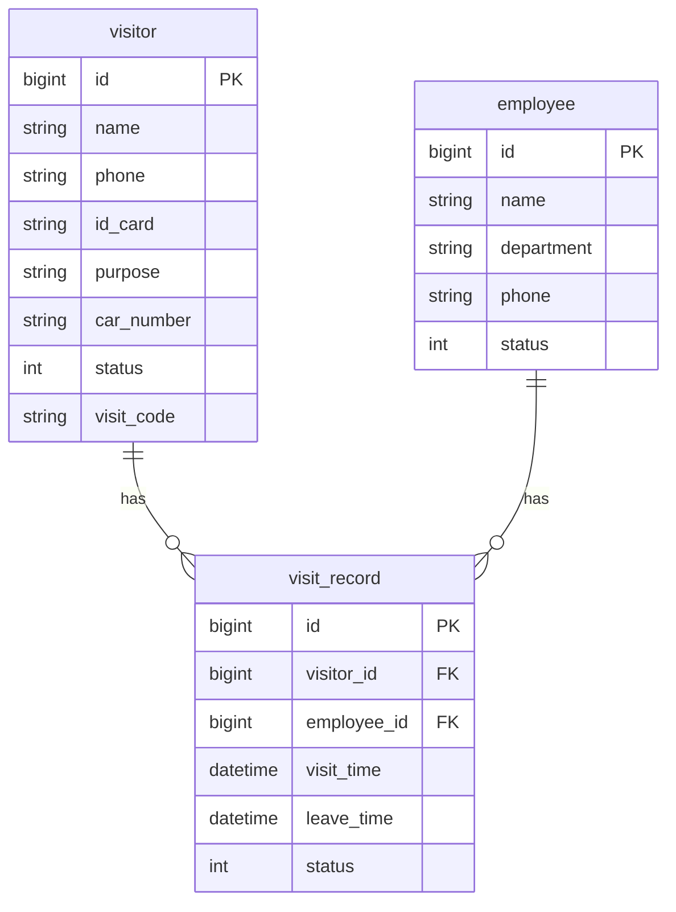
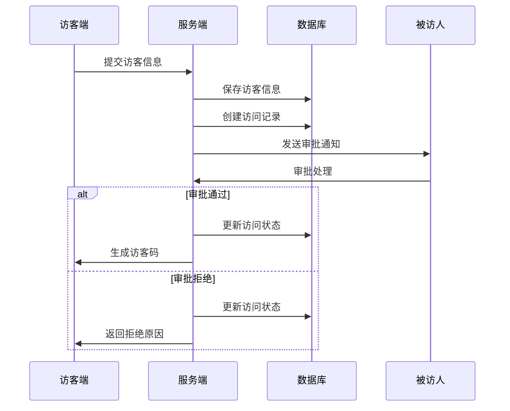

# 访客系统概要设计文档

## 1. 数据结构设计

### 1.1 访客信息表(visitor)
```sql
CREATE TABLE visitor (
    id BIGINT PRIMARY KEY AUTO_INCREMENT COMMENT '访客ID',
    name VARCHAR(50) NOT NULL COMMENT '访客姓名',
    phone VARCHAR(20) NOT NULL COMMENT '手机号',
    id_card VARCHAR(18) NOT NULL COMMENT '身份证号',
    purpose VARCHAR(200) NOT NULL COMMENT '来访目的',
    car_number VARCHAR(20) COMMENT '车牌号',
    status TINYINT NOT NULL DEFAULT 0 COMMENT '状态(0-待审批 1-已通过 2-已拒绝)',
    visit_code VARCHAR(32) COMMENT '访客码',
    created_time DATETIME NOT NULL COMMENT '创建时间',
    updated_time DATETIME NOT NULL COMMENT '更新时间'
) COMMENT '访客信息表';
```

### 1.2 被访人信息表(employee)
```sql
CREATE TABLE employee (
    id BIGINT PRIMARY KEY AUTO_INCREMENT COMMENT '员工ID',
    name VARCHAR(50) NOT NULL COMMENT '员工姓名',
    department VARCHAR(50) NOT NULL COMMENT '所属部门',
    phone VARCHAR(20) NOT NULL COMMENT '联系电话',
    status TINYINT NOT NULL DEFAULT 1 COMMENT '状态(0-禁用 1-启用)',
    created_time DATETIME NOT NULL COMMENT '创建时间',
    updated_time DATETIME NOT NULL COMMENT '更新时间'
) COMMENT '被访人信息表';
```

### 1.3 访问记录表(visit_record)
```sql
CREATE TABLE visit_record (
    id BIGINT PRIMARY KEY AUTO_INCREMENT COMMENT '记录ID',
    visitor_id BIGINT NOT NULL COMMENT '访客ID',
    employee_id BIGINT NOT NULL COMMENT '被访人ID',
    visit_time DATETIME COMMENT '来访时间',
    leave_time DATETIME COMMENT '离开时间',
    status TINYINT NOT NULL COMMENT '状态(0-待审批 1-已通过 2-已拒绝 3-已完成)',
    created_time DATETIME NOT NULL COMMENT '创建时间',
    updated_time DATETIME NOT NULL COMMENT '更新时间',
    FOREIGN KEY (visitor_id) REFERENCES visitor(id),
    FOREIGN KEY (employee_id) REFERENCES employee(id)
) COMMENT '访问记录表';
```

## 2. 实体关系图



## 3. 访客登记流程图



## 4. 核心接口设计

### 4.1 访客登记接口
```
POST /api/visitor/register

Request:
{
    "name": "string",      // 访客姓名
    "phone": "string",     // 手机号
    "idCard": "string",    // 身份证号
    "purpose": "string",   // 来访目的
    "carNumber": "string", // 车牌号
    "employeeId": "long"   // 被访人ID
}

Response:
{
    "code": 200,
    "message": "success",
    "data": {
        "visitorId": "long",    // 访客ID
        "recordId": "long"      // 访问记录ID
    }
}
```

### 4.2 访客审批接口
```
POST /api/visit/approve

Request:
{
    "recordId": "long",    // 访问记录ID
    "approved": "boolean", // 是否通过
    "visitTime": "string", // 预约时间
    "remark": "string"     // 备注说明
}

Response:
{
    "code": 200,
    "message": "success",
    "data": {
        "visitCode": "string"   // 访客码
    }
}
```