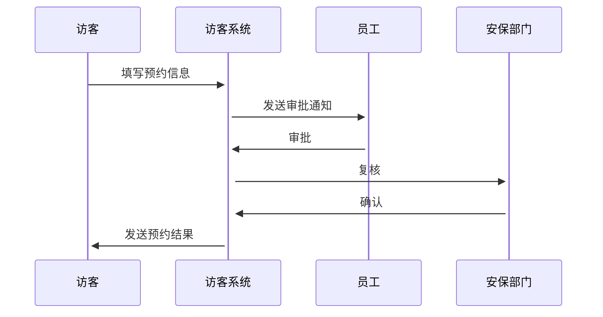
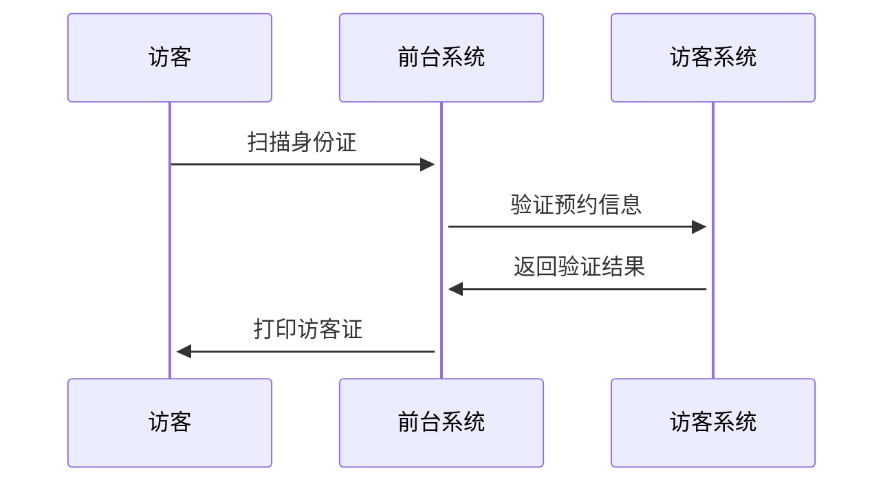

# 小鹏访客系统概要设计文档

## 1. 数据建模

### 1.1 核心实体

#### Visitor (访客)
```
- visitor_id: string (PK)
- name: string
- mobile: string 
- id_card: string
- face_photo: string
- create_time: datetime
- status: int
```

#### Employee (员工/被访人)
```
- employee_id: string (PK)
- name: string
- department: string
- mobile: string
- email: string
```

#### Appointment (预约单)
```
- appointment_id: string (PK)
- visitor_id: string (FK)
- employee_id: string (FK)
- visit_time: datetime
- leave_time: datetime
- purpose: string
- status: int
- create_time: datetime
```

#### VisitRecord (来访记录)
```
- record_id: string (PK)
- appointment_id: string (FK)
- checkin_time: datetime
- checkout_time: datetime
- status: int
```

## 2. 实体关系图(ER)


## 3. 关键流程时序图

### 3.1 访客预约流程


### 3.2 访客登记流程


## 4. 技术架构

### 4.1 系统分层
```
表现层: Vue.js + Element UI
业务层: Spring Boot
数据层: MySQL + Redis
```

### 4.2 核心服务
- 身份认证服务
- 预约管理服务
- 审批流程服务
- 门禁集成服务

## 5. 接口设计

### 5.1 预约接口
```
POST /api/v1/appointments
GET /api/v1/appointments/{id}
PUT /api/v1/appointments/{id}/approve
```

### 5.2 访客接口
```
POST /api/v1/visitors
GET /api/v1/visitors/{id}
PUT /api/v1/visitors/{id}/checkin
```

## 6. 安全设计
- 数据传输采用HTTPS加密
- 访客信息AES加密存储
- JWT实现身份认证
- 操作日志记录与审计