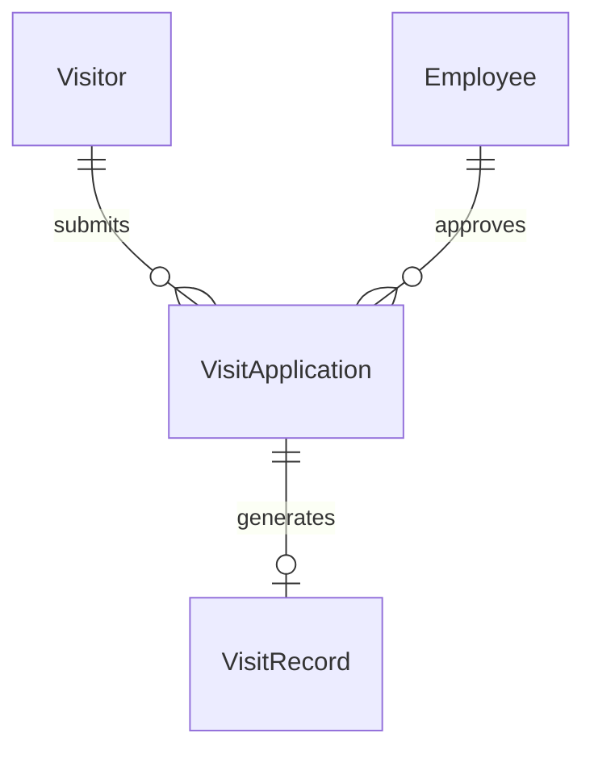
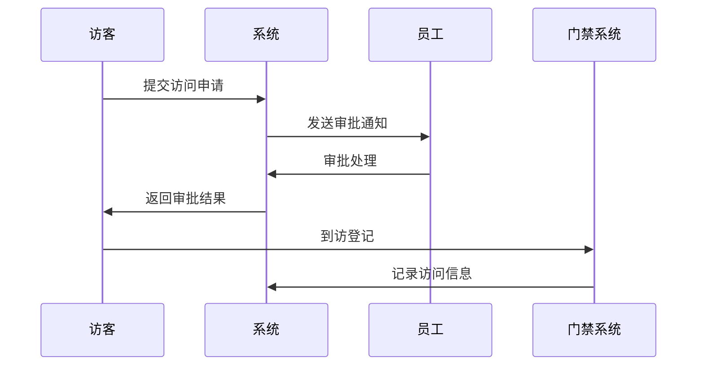
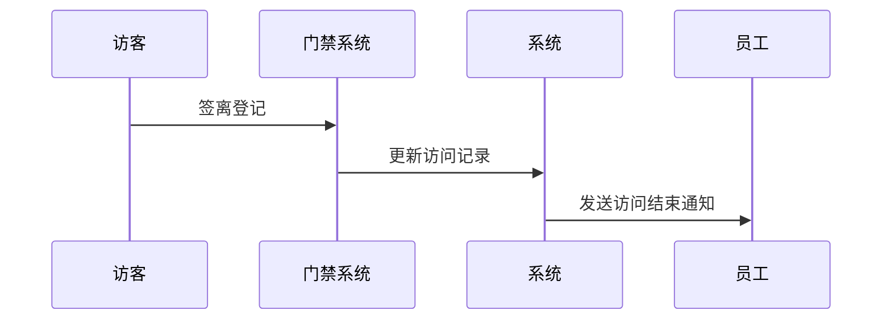

# 小鹏访客管理系统概要设计文档

## 1. 数据建模

### 1.1 核心实体

```sql
// 访客信息
Visitor {
  id: string (PK)
  name: string  
  phone: string
  idCard: string
  company: string
  visitPurpose: string
  status: int  // 0-待审批 1-已通过 2-已拒绝 3-已结束
  createTime: datetime
  updateTime: datetime
}

// 访问申请
VisitApplication {
  id: string (PK) 
  visitorId: string (FK)
  employeeId: string (FK)
  visitStartTime: datetime
  visitEndTime: datetime
  visitArea: string[]
  status: int
  createTime: datetime
  updateTime: datetime
}

// 员工信息
Employee {
  id: string (PK)
  name: string
  department: string
  phone: string
  email: string
}

// 访问记录
VisitRecord {
  id: string (PK)
  applicationId: string (FK)
  checkInTime: datetime  
  checkOutTime: datetime
  status: int // 0-未入场 1-已入场 2-已离场
}
```

## 2. 实体关系图



## 3. 核心流程时序图

### 3.1 访客申请流程



### 3.2 访客签离流程



## 4. 接口定义

### 4.1 访客接口
```
POST /api/visitor/apply
GET /api/visitor/list
PUT /api/visitor/{id}/status
```

### 4.2 审批接口
```
POST /api/approval/process
GET /api/approval/list
```

### 4.3 访问记录接口
```
POST /api/visit/checkin
POST /api/visit/checkout
GET /api/visit/records
```