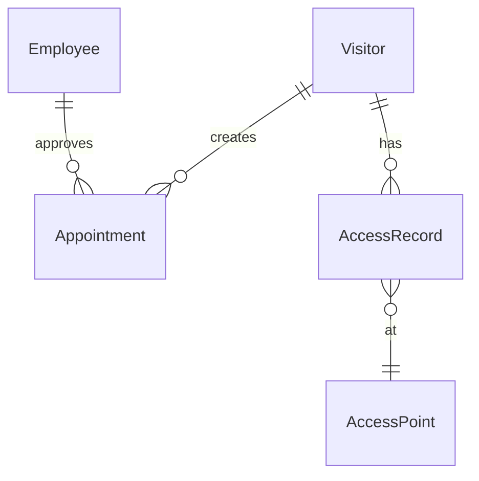
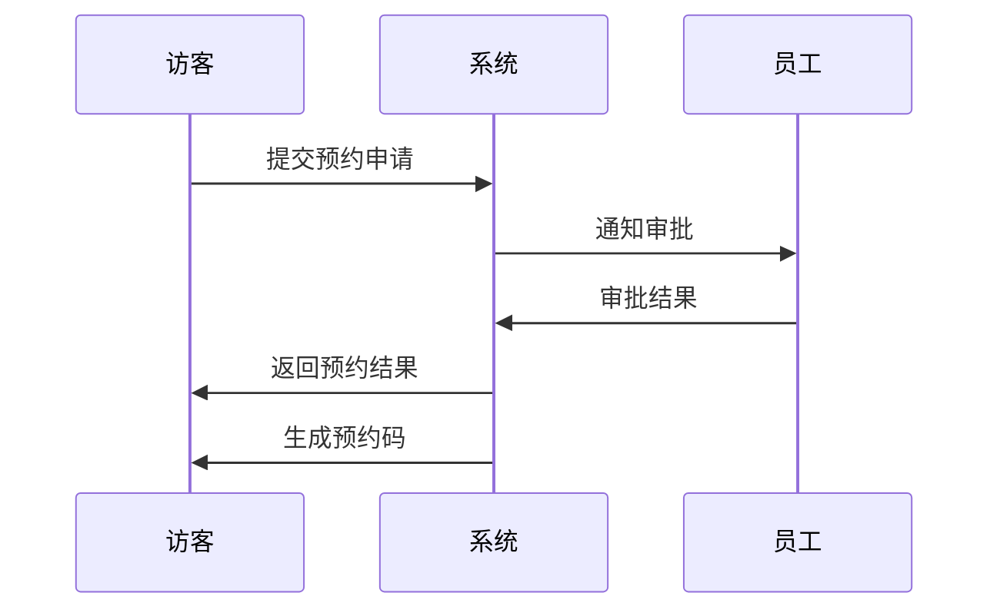
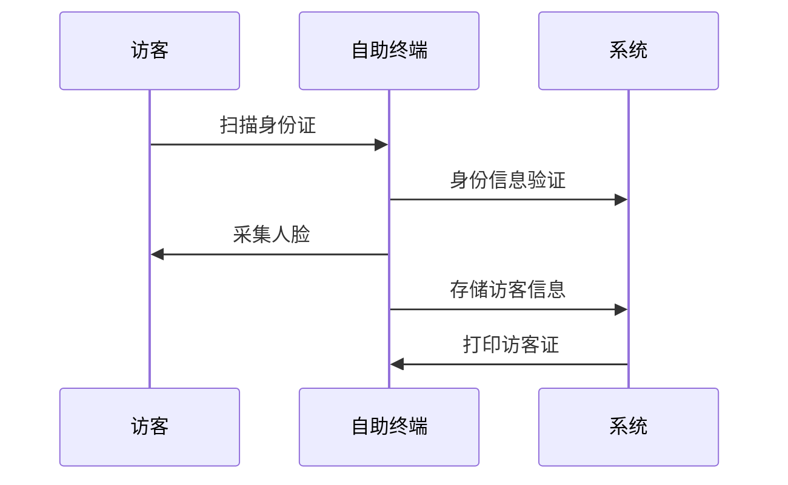

# 访客系统概要设计文档

## 1. 系统架构

### 1.1 整体架构
```
+----------------+     +----------------+     +----------------+
|   客户端层     |     |    应用层      |     |    数据层      |
|  Web/Mobile    | --> |  访客管理服务   | --> |   MySQL/Redis  |
+----------------+     +----------------+     +----------------+
```

## 2. 数据建模

### 2.1 核心实体

#### 访客(Visitor)
```sql
CREATE TABLE visitor (
    visitor_id varchar(32) PRIMARY KEY,
    name varchar(50),
    mobile varchar(20),
    id_card varchar(18),
    face_id varchar(64),
    status tinyint,
    created_time datetime
);
```

#### 预约单(Appointment)
```sql
CREATE TABLE appointment (
    appointment_id varchar(32) PRIMARY KEY,
    visitor_id varchar(32),
    employee_id varchar(32),
    visit_reason varchar(200),
    visit_time datetime,
    expire_time datetime,
    status tinyint,
    created_time datetime
);
```

#### 员工(Employee)
```sql
CREATE TABLE employee (
    employee_id varchar(32) PRIMARY KEY,
    name varchar(50),
    department varchar(50),
    mobile varchar(20),
    status tinyint
);
```

### 2.2 实体关系图


## 3. 核心流程

### 3.1 访客预约流程


### 3.2 访客登记流程


## 4. 接口设计

### 4.1 访客预约接口
```json
POST /api/v1/appointment
Request:
{
    "visitorName": "string",
    "mobile": "string",
    "employeeId": "string",
    "visitReason": "string",
    "visitTime": "datetime"
}
```

### 4.2 访客验证接口
```json
POST /api/v1/visitor/verify
Request:
{
    "appointmentId": "string",
    "faceImage": "base64",
    "idCard": "string"
}
```

## 5. 安全设计

- 数据传输采用HTTPS加密
- 访客敏感信息AES加密存储
- 接口调用JWT认证
- 数据库访问权限控制

## 6. 部署架构

```
                 负载均衡
                    |
    +------------------------------+
    |             |               |
应用服务器1    应用服务器2    应用服务器3
    |             |               |
    +------------------------------+
              数据库集群
```