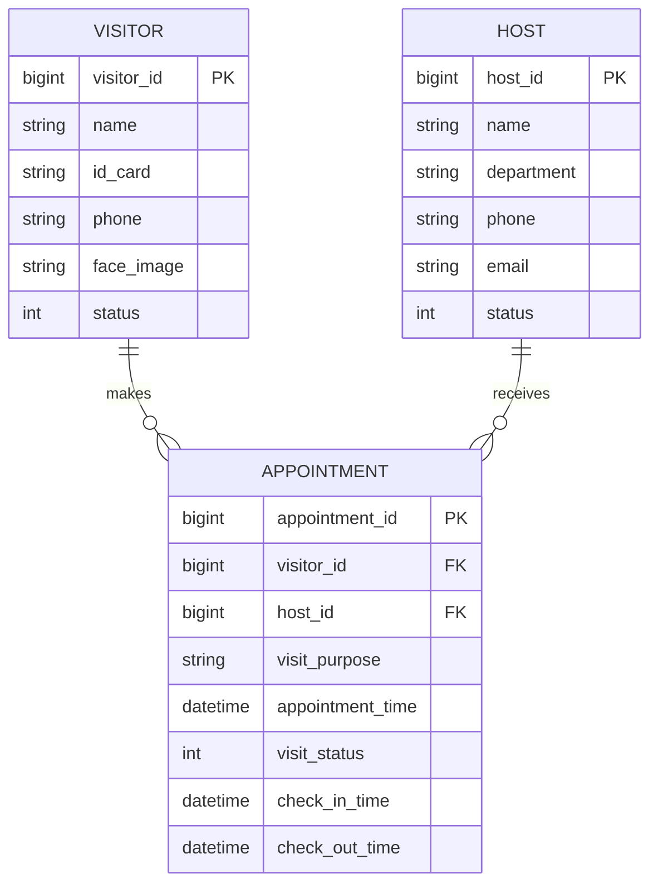
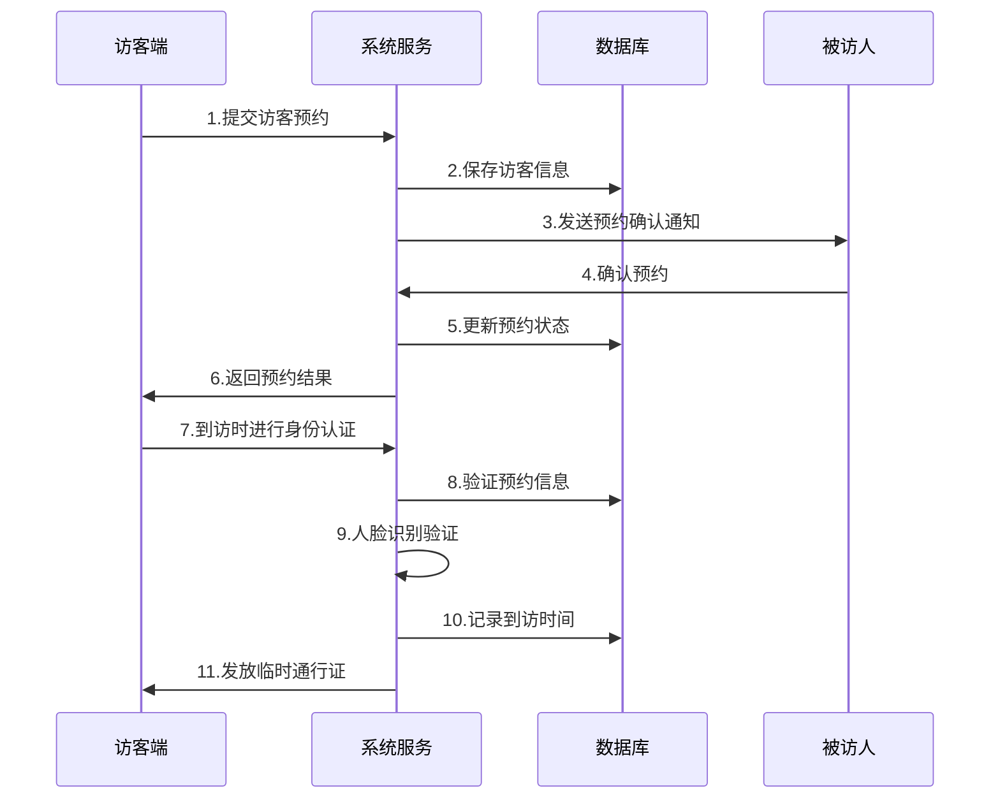

# 小鹏汽车访客系统概要设计文档

## 1. 数据结构设计

### 1.1 核心数据表

```sql
-- 访客信息表
CREATE TABLE visitor (
    visitor_id BIGINT PRIMARY KEY COMMENT '访客ID',
    name VARCHAR(50) NOT NULL COMMENT '访客姓名',
    id_card VARCHAR(18) NOT NULL COMMENT '身份证号',
    phone VARCHAR(11) NOT NULL COMMENT '手机号',
    face_image TEXT COMMENT '人脸图片存储路径',
    status TINYINT DEFAULT 0 COMMENT '状态(0-正常,1-黑名单)',
    created_at DATETIME COMMENT '创建时间',
    updated_at DATETIME COMMENT '更新时间'
) COMMENT '访客基本信息表';

-- 预约记录表
CREATE TABLE appointment (
    appointment_id BIGINT PRIMARY KEY COMMENT '预约ID',
    visitor_id BIGINT COMMENT '访客ID',
    host_id BIGINT COMMENT '被访人ID',
    visit_purpose VARCHAR(200) COMMENT '来访目的',
    appointment_time DATETIME COMMENT '预约时间',
    visit_status TINYINT DEFAULT 0 COMMENT '状态(0-待确认,1-已确认,2-已完成,3-已取消)',
    check_in_time DATETIME COMMENT '实际到访时间',
    check_out_time DATETIME COMMENT '离开时间',
    FOREIGN KEY (visitor_id) REFERENCES visitor(visitor_id),
    FOREIGN KEY (host_id) REFERENCES host(host_id)
) COMMENT '访客预约记录表';

-- 被访人信息表
CREATE TABLE host (
    host_id BIGINT PRIMARY KEY COMMENT '被访人ID',
    name VARCHAR(50) NOT NULL COMMENT '姓名',
    department VARCHAR(50) COMMENT '部门',
    phone VARCHAR(11) NOT NULL COMMENT '手机号',
    email VARCHAR(100) COMMENT '邮箱',
    status TINYINT DEFAULT 0 COMMENT '状态(0-在职,1-离职)'
) COMMENT '被访人信息表';
```

## 2. 实体关系图



## 3. 核心流程时序图



## 4. 关键接口设计

### 4.1 访客预约接口
```json
POST /api/v1/appointments
请求体:
{
    "visitorName": "张三",
    "idCard": "3301xxxxxxxxxxx",
    "phone": "13800138000",
    "hostId": 10001,
    "visitPurpose": "业务洽谈",
    "appointmentTime": "2025-01-21 14:00:00"
}

响应体:
{
    "code": 200,
    "data": {
        "appointmentId": 20001,
        "status": "PENDING_CONFIRMATION"
    }
}
```

### 4.2 身份认证接口
```json
POST /api/v1/auth/verify
请求体:
{
    "appointmentId": 20001,
    "faceImage": "base64_image_data"
}

响应体:
{
    "code": 200,
    "data": {
        "verified": true,
        "accessToken": "temp_token_xxx"
    }
}
```