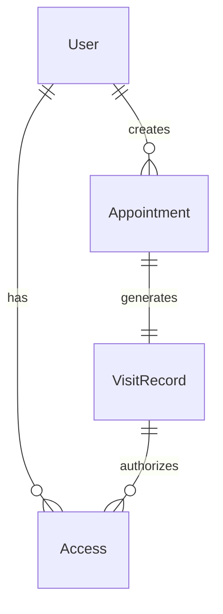
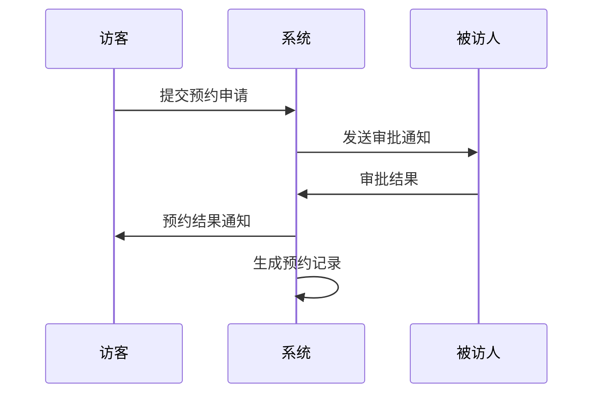
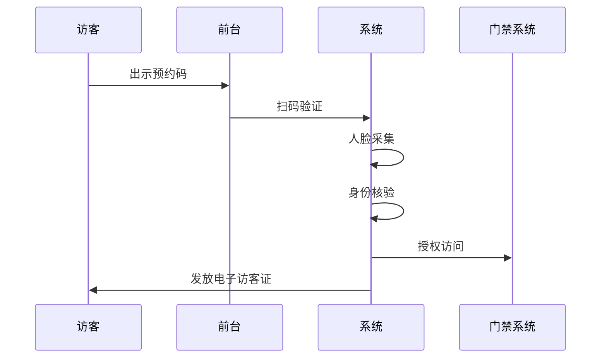

# 小鹏访客系统概要设计文档

## 1. 数据建模

### 1.1 核心实体

```sql
用户(User)
- user_id: string (PK)  
- name: string
- phone: string
- type: enum [员工/访客/管理员]
- status: enum [正常/禁用]
- create_time: datetime

访客预约(Appointment)
- appointment_id: string (PK)
- visitor_id: string (FK)
- host_id: string (FK) 
- visit_time: datetime
- leave_time: datetime
- purpose: string
- status: enum [待审批/已通过/已拒绝]

访客记录(VisitRecord) 
- record_id: string (PK)
- appointment_id: string (FK)
- check_in_time: datetime
- check_out_time: datetime
- status: enum [在访/离开]

门禁授权(Access)
- access_id: string (PK)
- visitor_id: string (FK)
- area_id: string
- valid_from: datetime
- valid_to: datetime
```

## 2. 实体关系图



## 3. 核心流程时序图

### 3.1 访客预约流程



### 3.2 访客登记流程



## 4. 接口设计

### 4.1 预约相关接口
```json
POST /api/v1/appointments
{
    "visitor_id": "string",
    "host_id": "string",
    "visit_time": "datetime",
    "purpose": "string"
}

GET /api/v1/appointments/{id}
PUT /api/v1/appointments/{id}/approve
PUT /api/v1/appointments/{id}/reject
```

### 4.2 访客登记接口
```json
POST /api/v1/visits/check-in
{
    "appointment_id": "string",
    "face_image": "base64",
    "id_card": "string"
}

POST /api/v1/visits/check-out
{
    "record_id": "string"
}
```

## 5. 安全设计

- 数据传输采用TLS 1.3加密
- 访客信息AES-256加密存储
- 人脸数据独立加密存储
- JWT + RBAC权限控制

## 6. 部署架构

```
负载均衡 (Nginx)
    ↓
应用服务器集群 (Kubernetes)
    ↓
缓存层 (Redis)
    ↓
数据库主从 (MySQL)
```