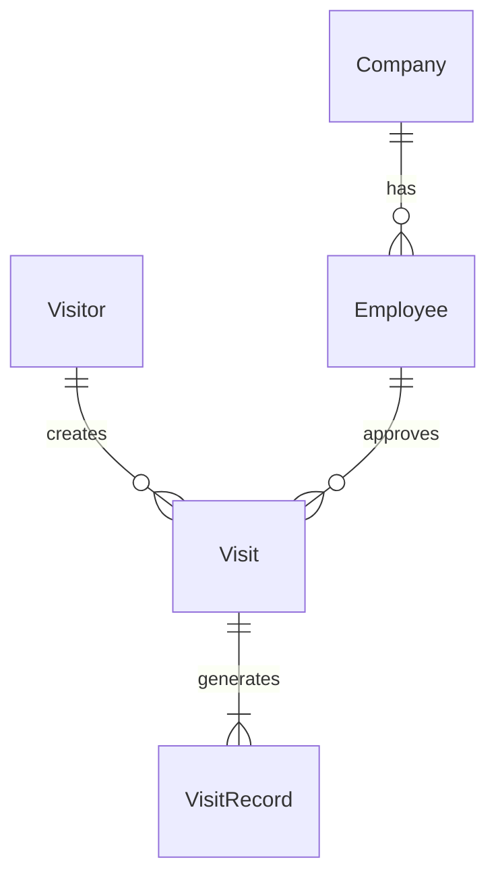
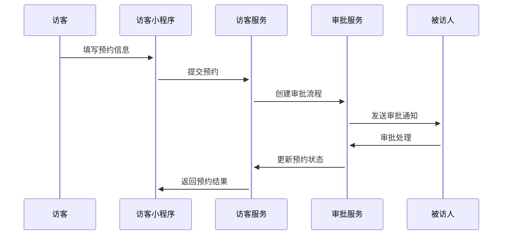
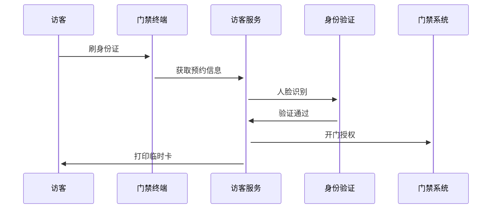

# 小鹏访客系统概要设计文档

## 1. 数据建模

### 1.1 核心实体定义

#### Visitor (访客)
```
- visitor_id: string (PK) 
- name: string          // 访客姓名
- mobile: string        // 手机号
- id_card: string      // 身份证号
- face_photo: string   // 人脸照片URL
- visitor_type: int    // 访客类型(1普通/2VIP)
- create_time: datetime
- status: int          // 状态(1正常/2黑名单)
```

#### Company (单位)
```
- company_id: string (PK)
- name: string        // 单位名称
- address: string     // 单位地址
- contact: string     // 联系人
- phone: string       // 联系电话
- status: int        // 状态(1正常/0停用)
```

#### Employee (员工)
```
- employee_id: string (PK)
- company_id: string (FK) 
- name: string
- department: string
- position: string     // 职位
- mobile: string  
- email: string
- status: int         // 状态(1在职/0离职)
```

#### Visit (访问申请)
```
- visit_id: string (PK)
- visitor_id: string (FK)
- employee_id: string (FK) 
- visit_time: datetime    // 来访时间
- leave_time: datetime    // 预计离开时间
- visit_area: string      // 访问区域
- purpose: string         // 来访目的
- status: int            // 状态(0待审批/1已通过/2已拒绝)
- create_time: datetime
```

## 2. 实体关系图



## 3. 核心流程时序图

### 3.1 访客预约流程



### 3.2 访客签到流程



## 4. 关键接口定义

### 4.1 访客管理接口
```
POST /api/v1/visitors           // 新增访客
GET  /api/v1/visitors/{id}     // 获取访客信息
PUT  /api/v1/visitors/{id}     // 更新访客信息
GET  /api/v1/visitors/list     // 访客列表查询
```

### 4.2 预约管理接口
```
POST /api/v1/visits            // 创建预约
GET  /api/v1/visits/{id}      // 获取预约详情
PUT  /api/v1/visits/{id}/approve  // 预约审批
GET  /api/v1/visits/list      // 预约列表查询
```

## 5. 安全设计

- 访客身份信息加密存储
- 人脸识别防伪验证
- 数据传输TLS加密
- 操作日志实时记录
- 数据访问权限控制