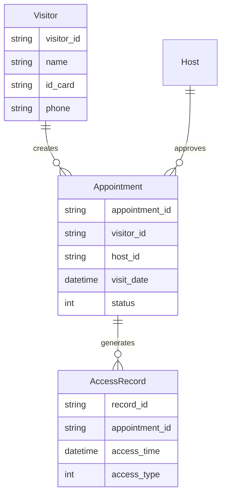
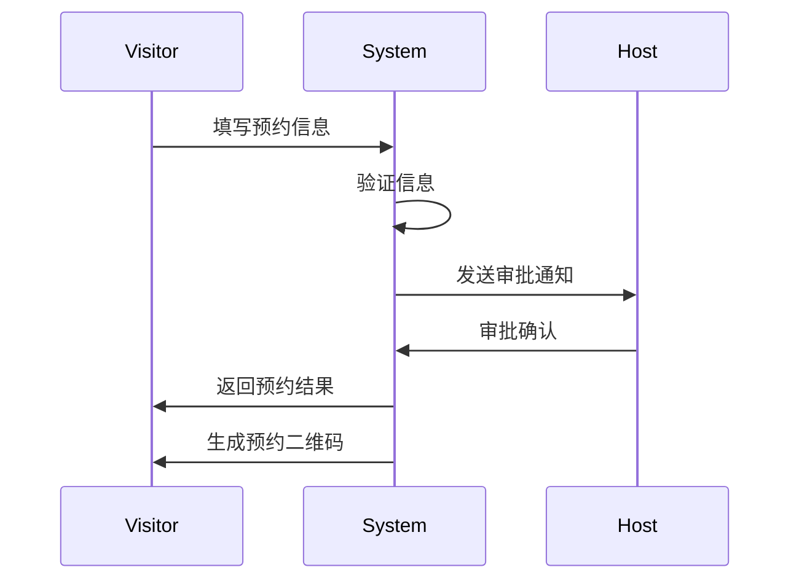
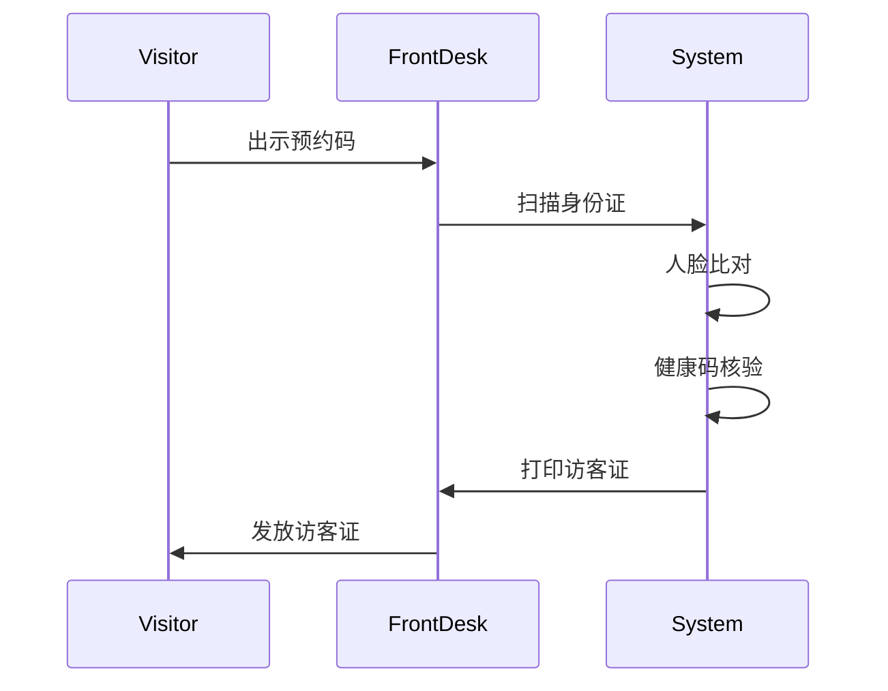

# 小鹏访客系统概要设计文档

## 1. 数据建模

### 1.1 核心实体

```sql
// 访客信息表
Visitor {
    visitor_id: string (PK)     // 访客ID
    name: string                // 姓名
    id_card: string            // 身份证号
    phone: string              // 手机号
    company: string            // 公司
    face_image: string         // 人脸照片
    status: int                // 状态(0-正常 1-黑名单)
}

// 预约记录表
Appointment {
    appointment_id: string (PK) // 预约ID  
    visitor_id: string (FK)     // 访客ID
    host_id: string (FK)        // 被访人ID
    visit_date: datetime        // 来访日期
    visit_purpose: string       // 来访目的
    area_code: string          // 访问区域
    status: int                // 状态(0-待审批 1-已通过 2-已拒绝)
}

// 通行记录表
AccessRecord {
    record_id: string (PK)     // 记录ID
    appointment_id: string (FK) // 预约ID
    access_time: datetime      // 通行时间
    access_type: int           // 类型(0-进入 1-离开)
    device_id: string          // 设备ID
}
```

## 2. 实体关系图



## 3. 核心时序图

### 3.1 访客预约流程



### 3.2 访客登记流程



## 4. 接口设计

### 4.1 API接口

```yaml
/api/v1/visitor:
  - 访客管理接口
/api/v1/appointment:
  - 预约管理接口
/api/v1/access:
  - 通行管理接口
```

### 4.2 外部系统接口

```yaml
- 门禁系统接口
- 电梯控制接口
- 身份证识别接口
- 人脸识别接口
```

## 5. 部署架构

```yaml
前端:
  - H5访客端
  - React管理后台
后端:
  - Spring Boot微服务
  - MySQL数据库
  - Redis缓存
  - RabbitMQ消息队列
```