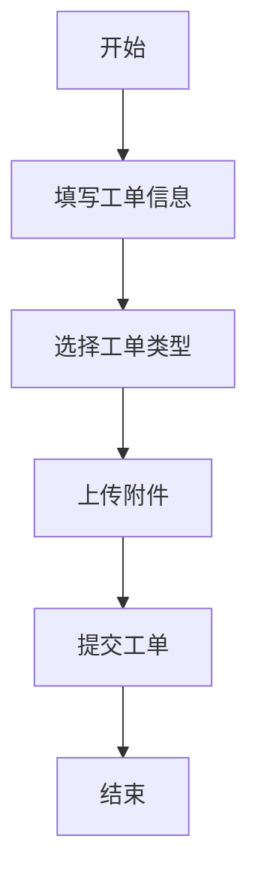

 # 咨询工单转交系统产品需求文档

## 1. 文档信息

- 文档状态：编写中
- 版本号：V1.0
- 作者：产品经理
- 最后更新日期：2024-01-01

## 2. 产品概述

### 2.1 产品背景
为提高客服工作效率，实现工单的有效分配和管理，开发咨询工单转交系统。

### 2.2 产品目标
- 提高工单处理效率
- 实现工单精准分配
- 跟踪工单处理状态
- 提升客户满意度

## 3. 功能需求

### 3.1 工单创建


#### 3.1.1 基本信息
- 工单标题
- 客户信息
- 问题描述
- 紧急程度
- 附件上传

### 3.2 工单分配
- 自动分配规则
- 手动转交功能
- 工单优先级设置
- 专业领域匹配

### 3.3 工单处理
- 工单状态更新
- 处理记录
- 内部备注
- 回复模板

### 3.4 工单监控
- 实时状态追踪
- 处理时效统计
- 绩效分析
- 满意度评价

## 4. 系统角色

### 4.1 管理员
- 系统配置
- 人员管理
- 权限分配
- 数据统计

### 4.2 客服人员
- 工单处理
- 工单转交
- 回复客户

### 4.3 质检人员
- 工单审核
- 质量评估
- 意见反馈

## 5. 界面原型

### 5.1 工单列表
```
+-------------------+
|  工单列表         |
+-------------------+
| ID  标题  状态    |
|-------------------|
| #1  XXXX  处理中  |
| #2  XXXX  待处理  |
| #3  XXXX  已完成  |
+-------------------+
```

### 5.2 工单详情
```
+------------------------+
|     工单详情           |
+------------------------+
| 标题：                 |
| 描述：                 |
| 附件：                 |
|------------------------|
| 处理记录：             |
| 1. XXXX               |
| 2. XXXX               |
+------------------------+
```

## 6. 非功能需求

### 6.1 性能需求
- 系统响应时间 <2秒
- 并发用户数 >100
- 数据备份周期：每日

### 6.2 安全需求
- 用户认证
- 数据加密
- 操作日志
- 权限控制

## 7. 项目规划

### 7.1 开发周期
- 需求分析：1周
- 设计开发：4周
- 测试部署：2周
- 总周期：7周

### 7.2 优先级
1. 工单基础功能
2. 转交分配功能
3. 监控统计功能
4. 系统优化升级

## 8. 附录

### 8.1 术语说明
- 工单：客户咨询记录单
- SLA：服务水平协议
- KPI：关键绩效指标

### 8.2 修订记录
| 版本 | 日期 | 修改内容 |
|------|------|----------|
| V1.0 | 2024-01-01 | 初稿 |