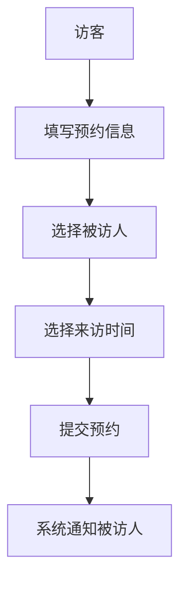

 # 访客系统产品需求文档

## 1. 文档信息
- 文档状态：初稿
- 版本号：V1.0
- 创建日期：2024-01-01
- 最后修改日期：2024-01-01

## 2. 产品概述
### 2.1 产品背景
为提升企业访客管理效率和安全性，开发访客系统对来访人员进行规范化管理。

### 2.2 产品目标
- 实现访客全流程数字化管理
- 提高访客登记效率
- 保障企业安全

## 3. 功能需求
### 3.1 访客预约


#### 功能点
1. 访客信息登记
   - 姓名
   - 手机号
   - 身份证号
   - 来访目的
2. 被访人选择
3. 来访时间选择
4. 预约确认

### 3.2 来访登记


#### 功能点
1. 二维码扫描登记
2. 人脸识别验证
3. 访客证打印
4. 记录进入时间

### 3.3 访客离场
1. 归还访客证
2. 记录离开时间
3. 自动结束访问

### 3.4 管理后台
1. 访客记录查询
2. 数据统计报表
3. 黑名单管理
4. 系统配置

## 4. 非功能需求
### 4.1 性能需求
- 系统响应时间：<2秒
- 并发访问：支持100人同时在线
- 数据备份：每日备份

### 4.2 安全需求
- 数据加密存储
- 访问权限控制
- 操作日志记录

## 5. 界面原型
### 5.1 访客预约界面
```
+-------------------------+
|     访客预约           |
+-------------------------+
| 姓名:[____________]     |
| 手机:[____________]     |
| 证件:[____________]     |
| 目的:[____________]     |
| 被访人:[ 选择 v ]      |
| 时间:[ 选择日期时间 ]  |
|                         |
| [提交预约]             |
+-------------------------+
```

### 5.2 管理后台界面
```
+---------------------------+
|  访客管理系统            |
+---------------------------+
| [统计] [记录] [设置]     |
|                          |
| 访客记录列表            |
| 日期 姓名 状态 操作     |
| ----------------------   |
| ...                      |
+---------------------------+
```

## 6. 项目规划
### 6.1 开发周期
- 需求分析：1周
- 设计开发：4周
- 测试上线：2周

### 6.2 风险评估
1. 系统稳定性风险
2. 数据安全风险
3. 用户适应性风险

## 7. 附录
### 7.1 术语说明
- 访客：外来人员
- 被访人：企业内部员工

### 7.2 修订记录
| 版本 | 日期 | 修改内容 | 修改人 |
|------|------|----------|--------|
| V1.0 | 2024-01-01 | 创建文档 | PM |