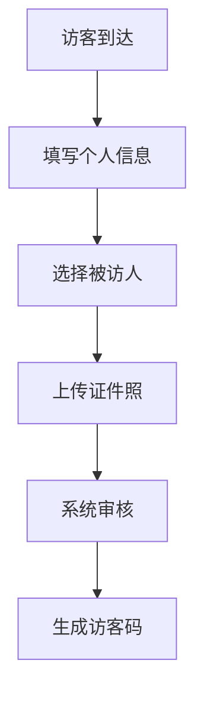
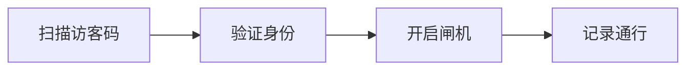

 # 访客系统产品需求文档

## 1. 文档信息

| 文档信息 | 内容 |
|----------|------|
| 项目名称 | 访客系统 |
| 文档版本 | V1.0 |
| 作者     | PM |
| 最后更新 | 2024-01-01 |

## 2. 修订记录

| 版本号 | 修订日期 | 修订内容 | 修订人 |
|--------|----------|----------|--------|
| V1.0   | 2024-01-01 | 首次创建 | PM |

## 3. 产品概述

### 3.1 产品背景
- 提高访客管理效率
- 加强单位安全管理
- 实现访客信息电子化管理

### 3.2 产品目标
- 规范访客登记流程
- 提升访客体验
- 保障单位安全
- 提供数据分析能力

## 4. 功能需求

### 4.1 访客登记模块


#### 4.1.1 基本信息采集
- 姓名
- 手机号
- 身份证号
- 来访目的
- 预计离开时间

#### 4.1.2 被访人信息
- 姓名
- 部门
- 工号
- 联系方式

### 4.2 审核管理模块
- 访客审核
- 访问记录查询
- 黑名单管理
- 访客统计报表

### 4.3 访客通行模块


## 5. 非功能需求

### 5.1 性能需求
- 系统响应时间：≤2秒
- 并发访问量：≥100人/分钟
- 系统可用性：≥99.9%

### 5.2 安全需求
- 数据加密传输
- 访客信息脱敏处理
- 定期数据备份
- 操作日志记录

### 5.3 兼容性要求
- 支持主流浏览器
- 支持移动端访问

## 6. 界面原型

### 6.1 访客登记页面
```
+----------------------+
|     访客登记        |
+----------------------+
| 姓名:[          ]   |
| 手机:[          ]   |
| 证件:[          ]   |
| 目的:[          ]   |
| 被访人:[ 选择 v ]   |
+----------------------+
|      提交登记       |
+----------------------+
```

### 6.2 管理后台界面
```
+--------------------------------+
|  访客系统管理后台              |
+--------------------------------+
| [ 待审核 ]  [ 已审核 ] [ 统计 ]|
|                                |
| +----------------------------+ |
| |  访客列表                 | |
| |  姓名  时间  状态  操作   | |
| |  ...                      | |
| +----------------------------+ |
+--------------------------------+
```

## 7. 项目实施

### 7.1 实施阶段
1. 需求调研与分析
2. 系统设计
3. 开发实现
4. 测试验证
5. 部署上线
6. 运维支持

### 7.2 时间规划
- 需求分析：2周
- 设计开发：8周
- 测试部署：2周
- 总工期：12周

## 8. 风险评估

| 风险点 | 影响程度 | 应对措施 |
|--------|----------|----------|
| 系统安全性 | 高 | 加强数据加密，定期安全测试 |
| 访客流量峰值 | 中 | 优化系统性能，设置流量限制 |
| 用户适应性 | 低 | 加强培训，优化操作流程 |

## 9. 附录

### 9.1 术语表
- 访客码：用于访客通行的唯一电子凭证
- 黑名单：记录违规访客信息的数据库

### 9.2 参考文档
- 《安全管理规范》
- 《个人信息保护法》