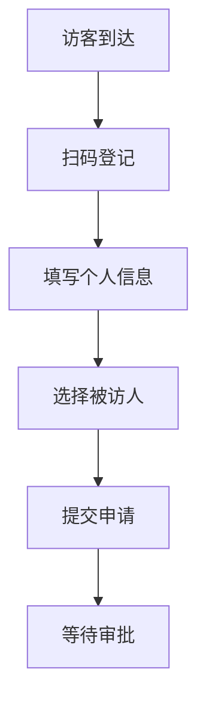
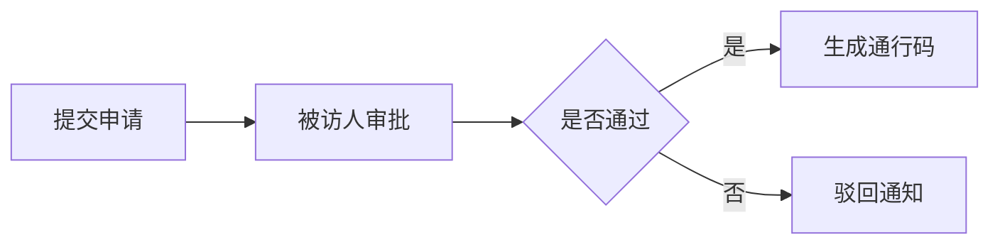

 # 访客系统产品需求文档(PRD)

## 1. 文档信息
- 文档版本：V1.0
- 创建日期：2024-01-01
- 最后更新：2024-01-01

## 2. 产品概述
### 2.1 产品背景
为提升企业访客管理效率和安全性，开发访客系统实现访客登记、审批、通行的全流程电子化管理。

### 2.2 产品目标
- 提升访客登记效率
- 加强企业安全管理
- 实现访客数据可追溯
- 优化访客体验

## 3. 功能需求
### 3.1 访客登记模块


#### 3.1.1 基础信息采集
- 姓名
- 手机号
- 身份证号
- 来访目的
- 预计来访时间
- 预计离开时间

#### 3.1.2 被访人选择
- 搜索被访人
- 选择部门
- 确认被访人信息

### 3.2 审批流程


### 3.3 通行管理
- 电子通行码生成
- 通行码验证
- 访客签离

### 3.4 数据管理
- 访客记录查询
- 访客统计报表
- 异常预警管理

## 4. 非功能需求
### 4.1 性能需求
- 系统响应时间 < 2秒
- 并发访问量支持 100 人/分钟
- 系统可用性 99.9%

### 4.2 安全需求
- 数据加密传输
- 访客信息脱敏处理
- 权限分级管理

## 5. 界面原型
### 5.1 访客登记页
```
+------------------+
|   访客登记      |
+------------------+
| 姓名 [        ] |
| 手机 [        ] |
| 证件 [        ] |
| 目的 [        ] |
|                  |
| [选择被访人]    |
|                  |
| [  提交申请  ]  |
+------------------+
```

### 5.2 审批页面
```
+------------------+
|   访客审批      |
+------------------+
| 访客信息        |
| 时间信息        |
| 来访事由        |
|                  |
| [通过] [拒绝]   |
+------------------+
```

## 6. 项目实施
### 6.1 开发周期
- 需求分析：1周
- 设计开发：3周
- 测试部署：1周
- 总周期：5周

### 6.2 风险评估
- 数据安全风险
- 系统稳定性风险
- 用户适应性风险

## 7. 验收标准
- 功能完整性测试通过
- 性能指标达标
- 安全测试通过
- 用户体验评估合格