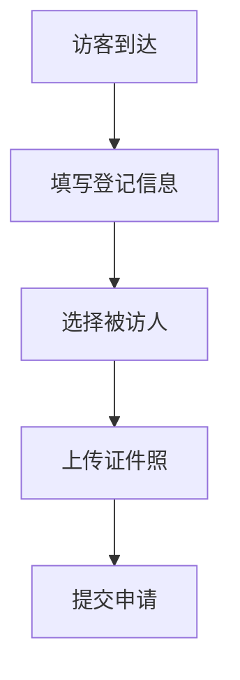
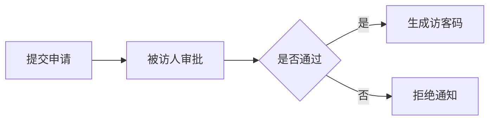

 # 访客系统产品需求文档

## 1. 文档信息
- 文档版本：V1.0
- 创建时间：2024-01-20
- 作者：产品经理

## 2. 产品概述
访客系统是一套用于管理来访人员的系统，实现来访登记、审批、通知等功能，提高企业访客管理效率和安全性。

## 3. 功能需求

### 3.1 访客登记


#### 功能描述
- 访客基本信息登记
- 被访人选择
- 来访事由填写
- 证件照片采集
- 访问时间选择

### 3.2 审批流程


#### 功能描述
- 被访人审批
- 自动通知
- 访客码生成

### 3.3 访客管理
- 访客记录查询
- 访客状态跟踪
- 访问统计报表
- 黑名单管理

### 3.4 系统管理
- 用户权限管理
- 部门管理
- 系统配置
- 日志管理

## 4. 非功能需求
### 4.1 性能需求
- 系统响应时间：<2秒
- 并发用户数：>100
- 系统可用性：99.9%

### 4.2 安全需求
- 数据加密传输
- 访客信息脱敏
- 权限分级控制

### 4.3 兼容性要求
- 支持主流浏览器
- 支持移动端访问

## 5. 界面原型
### 5.1 访客登记界面
```
+------------------------+
|     访客登记系统        |
+------------------------+
| 姓名: [          ]     |
| 手机: [          ]     |
| 证件号:[        ]      |
| 来访事由:             |
| [                ]     |
| 被访人: [选择▼]        |
| 来访时间:             |
| [日期选择器]           |
|                        |
| [提交] [取消]          |
+------------------------+
```

### 5.2 审批界面
```
+------------------------+
|     访客审批           |
+------------------------+
| 访客信息：             |
| 姓名：张三             |
| 来访事由：商务洽谈      |
| 时间：2024-01-20      |
|                        |
| [同意] [拒绝]          |
+------------------------+
```

## 6. 开发计划
### 6.1 开发周期
- 需求分析：1周
- 设计开发：3周
- 测试：1周
- 部署上线：1周

### 6.2 优先级
1. 访客登记功能
2. 审批流程
3. 访客管理
4. 系统管理

## 7. 风险评估
- 数据安全风险
- 系统稳定性风险
- 用户适应性风险

## 8. 附录
### 8.1 术语说明
- 访客码：用于访客进出的唯一标识
- 黑名单：记录违规访客信息的列表

### 8.2 参考文档
- 《访客管理规范》
- 《数据安全规范》