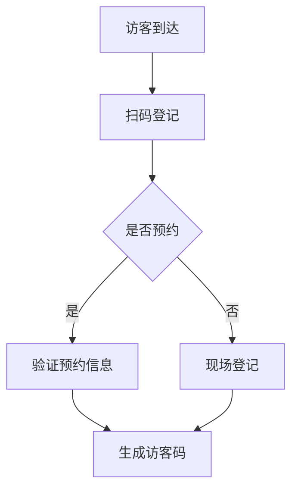
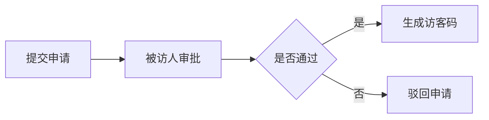

 # 访客系统产品需求文档

## 1. 文档信息

- 文档版本：V1.0
- 作者：产品经理
- 创建日期：2024-01-01

## 2. 产品概述

### 2.1 产品背景
为提升企业访客管理的规范性和安全性，开发访客系统对来访人员进行身份识别、登记和管理。

### 2.2 产品目标
- 实现访客信息电子化管理
- 提高访客登记效率
- 加强企业安全管理
- 优化访客体验

## 3. 功能需求

### 3.1 访客登记


#### 3.1.1 访客信息采集
- 姓名
- 手机号
- 身份证号
- 来访目的
- 被访人信息
- 随身物品登记
- 到访时间

#### 3.1.2 预约管理
- 在线预约
- 预约审批
- 预约信息修改
- 预约取消

### 3.2 访客审批


### 3.3 访客通行
- 二维码通行
- 人脸识别通行
- 临时通行证管理

### 3.4 记录查询
- 访客记录查询
- 访问统计报表
- 异常记录管理

## 4. 非功能需求

### 4.1 性能需求
- 系统响应时间：<3秒
- 并发访问量：>100人/分钟
- 系统可用性：99.9%

### 4.2 安全需求
- 数据加密存储
- 访问权限控制
- 操作日志记录
- 数据备份机制

### 4.3 兼容性要求
- 支持主流浏览器
- 支持移动端访问
- 支持二维码扫描

## 5. 界面原型

### 5.1 访客登记界面
```
+----------------------+
|    访客登记         |
+----------------------+
| 姓名：[          ]  |
| 手机：[          ]  |
| 证件：[          ]  |
| 目的：[          ]  |
| 被访人：[选择   v]  |
+----------------------+
|     [提交登记]      |
+----------------------+
```

### 5.2 访客审批界面
```
+----------------------+
|    访客审批         |
+----------------------+
| □ 张三  13:00       |
|   目的：业务洽谈    |
| □ 李四  14:00       |
|   目的：面试        |
+----------------------+
| [通过] [驳回]       |
+----------------------+
```

## 6. 项目规划

### 6.1 开发周期
- 需求分析：2周
- 设计开发：8周
- 测试验证：2周
- 部署上线：1周

### 6.2 项目里程碑
1. 需求确认完成
2. 产品原型确认
3. 开发完成
4. 测试通过
5. 正式上线

## 7. 风险评估

### 7.1 潜在风险
- 系统安全风险
- 数据泄露风险
- 系统稳定性风险
- 用户适应性风险

### 7.2 应对措施
- 加强安全防护
- 完善数据保护
- 系统性能优化
- 加强用户培训

## 8. 附录

### 8.1 术语说明
- 访客：外来人员
- 被访人：企业内部员工
- 访客码：用于通行的电子凭证

### 8.2 相关文档
- 系统操作手册
- 安全管理规范
- 应急预案