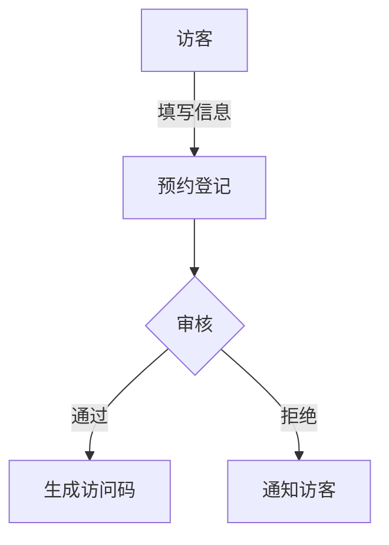
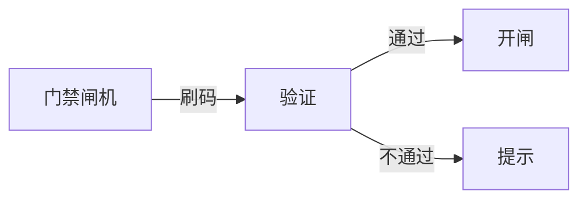

 # 访客系统产品需求文档

## 1. 文档信息

- 文档版本：V1.0
- 创建日期：2024-01-21
- 产品负责人：PM

## 2. 产品概述

### 2.1 产品背景
为提升企业访客管理效率，保障企业安全，开发访客管理系统实现访客流程数字化。

### 2.2 产品目标
1. 规范访客登记流程  
2. 提高访客通行效率
3. 加强企业安全管理  
4. 实现访客数据可追溯

## 3. 功能需求

### 3.1 访客预约


#### 3.1.1 预约信息
- 访客姓名
- 联系电话
- 来访时间
- 来访事由  
- 被访人信息

### 3.2 来访登记
- 身份证识别
- 人脸采集
- 健康码核验
- 访问码验证

### 3.3 通行管理


### 3.4 访客离场
- 自动记录离场时间
- 统计在访时长

## 4. 非功能需求

### 4.1 性能需求
- 系统响应时间<2秒
- 支持并发访问>100

### 4.2 安全需求  
- 数据加密存储
- 访客信息脱敏展示
- 权限分级管理

## 5. 界面原型

### 5.1 访客预约界面
```
+----------------------+
|     访客预约         |
+----------------------+
| 姓名:[          ]    |
| 电话:[          ]    |
| 时间:[日期选择  ]    |
| 事由:[          ]    |
| 被访人:[        ]    |
|                      |
| [提交预约]           |
+----------------------+
```

### 5.2 管理后台界面
```
+------------------------+
|  访客管理系统          |
+------------------------+
|  [预约管理]            |
|  [实时访客]            |
|  [统计报表]            |
|  [系统设置]            |
+------------------------+
```

## 6. 数据需求

### 6.1 数据存储
- 访客基本信息
- 预约记录
- 通行记录
- 系统日志

### 6.2 数据统计
- 日访客量
- 月度统计
- 访问时长分析

## 7. 项目实施

### 7.1 开发周期
- 需求分析：1周
- 开发周期：4周
- 测试周期：2周
- 上线部署：1周

### 7.2 优先级
P0：基础访客功能
P1：数据统计分析
P2：系统优化升级

## 8. 风险评估

1. 系统安全风险
2. 数据合规风险  
3. 使用习惯适应风险

## 9. 附录

### 9.1 术语说明
- 访问码：唯一身份标识
- 通行记录：进出记录

### 9.2 修订记录
- V1.0 2024-01-21 创建文档