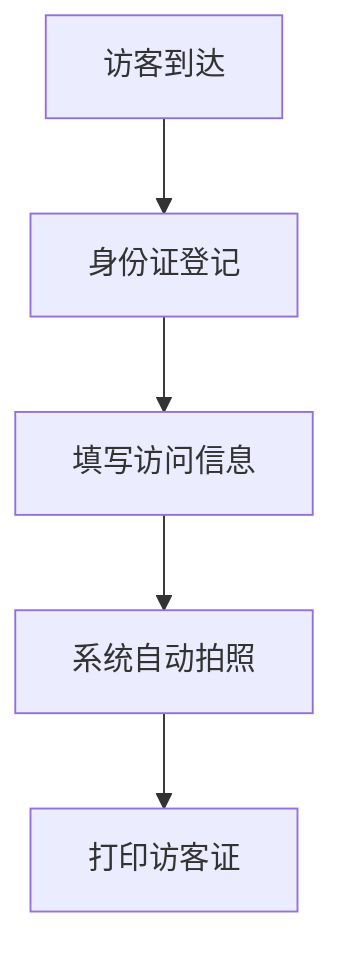

 # 访客系统产品需求文档(PRD)

## 文档信息
- 文档状态：初稿
- 撰写人：产品经理
- 创建日期：2024-01-20
- 最后更新：2024-01-20

## 1. 产品概述

### 1.1 产品背景
随着企业安全管理需求的提升，访客管理系统成为企业管理中不可或缺的部分，用于规范访客登记流程、提高安保效率。

### 1.2 产品目标
- 实现访客登记信息电子化管理
- 提高前台接待效率
- 增强企业安全管理水平
- 提供访客数据分析能力

## 2. 功能需求

### 2.1 访客登记模块


#### 2.1.1 基本信息采集
- 访客姓名
- 身份证号
- 联系电话
- 来访目的
- 被访人信息
- 来访时间

#### 2.1.2 身份认证
- 身份证读取功能
- 人脸采集
- 人证比对

### 2.2 访客审批模块


### 2.3 访客管理模块
- 访客记录查询
- 访客统计分析
- 黑名单管理
- 访问权限管理

### 2.4 系统管理模块
- 用户管理
- 角色权限管理
- 系统配置
- 日志管理

## 3. 非功能需求

### 3.1 性能需求
- 系统响应时间：<2秒
- 并发访问量：支持100人同时在线
- 数据备份：每日自动备份

### 3.2 安全需求
- 数据加密传输
- 访客信息脱敏处理
- 定期数据备份
- 访问权限控制

### 3.3 可用性需求
- 系统可用性：99.9%
- 7*24小时运行
- 友好的用户界面

## 4. 界面原型

### 4.1 访客登记界面
```
+------------------------+
|     访客登记系统        |
+------------------------+
| 姓名：[____________]   |
| 证件号：[___________]  |
| 电话：[____________]   |
| 来访事由：[_________]  |
| 被访人：[___________]  |
|                        |
| [拍照] [提交]         |
+------------------------+
```

### 4.2 审批界面
```
+------------------------+
|     访客审批          |
+------------------------+
| □ 张三 13:00          |
|   来访目的：商务洽谈   |
|                        |
| □ 李四 14:30          |
|   来访目的：面试       |
|                        |
| [通过] [拒绝]         |
+------------------------+
```

## 5. 项目规划

### 5.1 开发周期
- 需求分析：1周
- 设计开发：4周
- 测试：2周
- 部署上线：1周

### 5.2 迭代计划
- 第一期：基础访客登记功能
- 第二期：审批流程
- 第三期：统计分析功能
- 第四期：系统优化

## 6. 风险评估
1. 数据安全风险
2. 系统稳定性风险
3. 用户适应性风险
4. 硬件设备兼容性风险

## 7. 附录
### 7.1 术语说明
- 访客：外来人员
- 被访人：企业内部员工
- 访客证：临时通行凭证

### 7.2 相关文档
- 《安全管理制度》
- 《访客管理规范》
- 《数据安全规范》