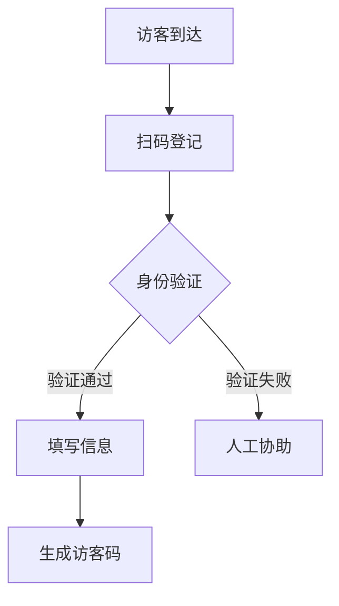
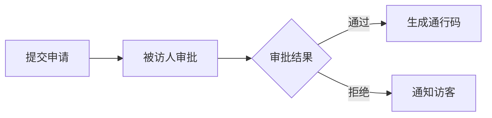

 # 访客系统产品需求文档

## 1. 文档信息
- 文档版本：V1.0
- 创建日期：2024-01-10
- 作者：产品经理

## 2. 产品概述
访客系统是一套面向企业/园区的访客管理解决方案，用于规范和管理外来人员的登记、审批和出入流程。

## 3. 产品目标
- 提升访客登记效率
- 加强企业安全管理
- 优化访客体验
- 实现访客数据可追溯

## 4. 功能需求

### 4.1 访客登记模块


#### 主要功能：
- 身份证识别
- 人脸采集
- 访问目的选择
- 被访人选择
- 健康信息登记
- 访客须知确认

### 4.2 审批管理模块


#### 主要功能：
- 访问申请审批
- 一键同意/拒绝
- 审批记录查询
- 自动审批规则配置

### 4.3 通行管理模块
- 二维码通行
- 人脸识别通行
- 访客证打印
- 通行记录查询

### 4.4 统计分析模块
- 访客流量统计
- 访问目的分析
- 部门访客统计
- 异常访问预警

## 5. 非功能需求

### 5.1 性能需求
- 系统响应时间：<3秒
- 并发处理能力：>100次/秒
- 系统可用性：99.9%

### 5.2 安全需求
- 数据加密存储
- 访问权限控制
- 操作日志记录
- 敏感信息脱敏

### 5.3 兼容性要求
- 支持主流浏览器
- 支持移动端适配
- 支持主流门禁硬件

## 6. 界面原型

### 6.1 访客登记页
```
+------------------+
|   访客登记    ×  |
+------------------+
| [扫描身份证]     |
|                  |
| 姓名：[        ] |
| 手机：[        ] |
| 来访目的：[下拉] |
| 被访人：[搜索]   |
|                  |
| [提交登记]       |
+------------------+
```

### 6.2 审批管理页
```
+------------------+
|   审批管理    ×  |
+------------------+
| 待审批(5)  已审批|
|                  |
| - 张三 13:14     |
|   来访目的：面试 |
|   [同意] [拒绝]  |
|                  |
| - 李四 12:30     |
|   来访目的：商务 |
|   [同意] [拒绝]  |
+------------------+
```

## 7. 项目规划

### 7.1 开发排期
- Phase 1: 基础功能开发（3周）
- Phase 2: 系统联调测试（2周）
- Phase 3: 试运行优化（1周）

### 7.2 验收标准
- 功能验收通过率100%
- 性能指标达标
- 安全测试通过
- 用户体验评分>4.5

## 8. 附录
- 数据字典
- 接口文档
- 原型文件
- 测试用例