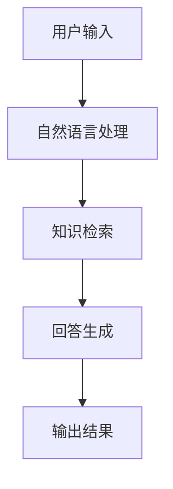

 # 产品需求文档

## 1. 文档信息
- 文档版本：V1.0
- 创建日期：2024-01-01
- 最后更新：2024-01-01

## 2. 产品概述
### 2.1 产品背景
我是一个智能助手，旨在帮助用户解决各类问题和需求。

### 2.2 产品定位
- 目标用户：所有需要帮助的人
- 使用场景：日常交流、问题解答、任务协助

## 3. 功能需求
### 3.1 核心功能


### 3.2 功能列表
- 自然语言对话
- 知识问答
- 任务协助
- 多轮对话

## 4. 界面设计
```
+------------------------+
|      对话界面         |
|                       |
| [用户输入框]          |
|                       |
| 用户：你好           |
| 助手：很高兴见到您    |
|                       |
+------------------------+
```

## 5. 技术要求
- 响应时间：<1秒
- 可用性：99.9%
- 并发用户：>1000

## 6. 安全要求
- 数据加密
- 用户隐私保护
- 访问控制

## 7. 验收标准
- 准确率>95%
- 用户满意度>90%
- 系统稳定性达标

## 8. 项目排期
1. 开发阶段：2周
2. 测试阶段：1周
3. 上线阶段：1周

## 9. 风险评估
- 技术风险
- 运营风险
- 安全风险

## 10. 附录
### 10.1 术语表
### 10.2 参考文档