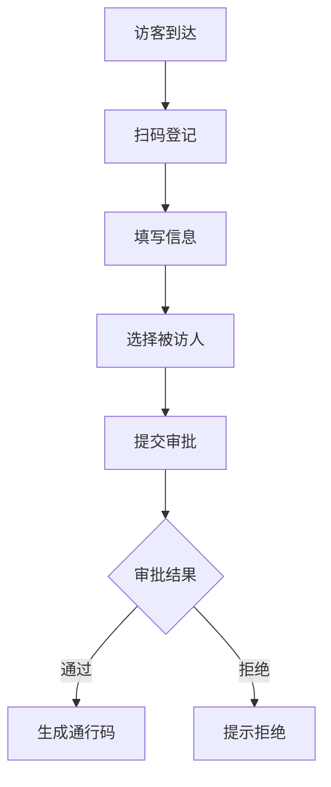

 # 访客系统产品需求文档

## 1. 文档信息

| 文档状态 | 创建 |
|----------|------|
| 创建人   | PM   |
| 创建时间 | 2024-01-01 |
| 版本号   | V1.0  |

## 2. 产品概述

### 2.1 产品背景
为提升企业访客管理效率、保障企业安全，开发访客系统对来访人员进行登记、审批和管理。

### 2.2 产品目标
- 规范访客登记流程
- 提高访客管理效率
- 加强企业安全管控
- 提供访客数据分析

## 3. 功能需求

### 3.1 访客登记


#### 3.1.1 基本信息登记
- 姓名
- 手机号
- 身份证号
- 来访目的
- 预计来访时间
- 预计离开时间

#### 3.1.2 被访人选择
- 搜索被访人
- 选择部门
- 填写拜访事由

### 3.2 审批管理
- 被访人审批
- 管理员审批
- 审批记录查询
- 审批通知推送

### 3.3 访客管理
- 在访人员查看
- 访客记录查询
- 黑名单管理
- 访客统计分析

## 4. 非功能需求

### 4.1 性能需求
- 系统响应时间 < 2秒
- 并发访问量 > 100人/分钟
- 系统可用性 > 99.9%

### 4.2 安全需求
- 数据加密传输
- 访客信息脱敏处理
- 操作日志记录
- 权限分级管理

## 5. 界面原型

### 5.1 访客登记界面
```
+----------------------+
|     访客登记        |
+----------------------+
| 姓名: [          ]  |
| 手机: [          ]  |
| 证件: [          ]  |
| 目的: [          ]  |
| 时间: [    ]-[    ] |
+----------------------+
| [   提交   ] [取消] |
+----------------------+
```

### 5.2 审批管理界面
```
+----------------------+
|     审批管理        |
+----------------------+
| □ 张三 市场部 会议  |
| □ 李四 技术部 面试  |
| □ 王五 财务部 洽谈  |
+----------------------+
| [批准] [拒绝] [详情]|
+----------------------+
```

## 6. 项目规划

### 6.1 开发周期
- 需求分析：1周
- 设计开发：4周
- 测试验证：2周
- 部署上线：1周

### 6.2 迭代计划
- v1.0：基础访客登记功能
- v1.1：审批流程优化
- v1.2：统计分析功能
- v2.0：移动端适配

## 7. 风险评估

### 7.1 潜在风险
- 访客信息安全泄露
- 系统性能瓶颈
- 用户接受度不高

### 7.2 应对措施
- 加强数据加密
- 性能优化和监控
- 加强用户培训