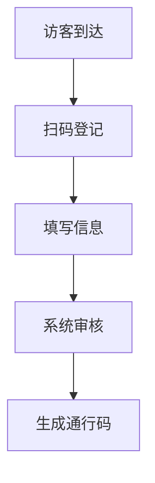

 # 访客系统产品需求文档

## 1. 文档信息
- 文档状态：初稿
- 版本号：V1.0
- 创建时间：2024-01-01

## 2. 产品概述
### 2.1 产品背景
为提升企业访客管理效率和安全性，开发访客系统对来访人员进行规范化管理。

### 2.2 产品目标
- 提高访客登记效率
- 增强企业安全管理
- 实现访客数据可追溯
- 优化接待流程

## 3. 功能需求
### 3.1 访客登记


#### 3.1.1 基本信息采集
- 姓名
- 手机号
- 身份证号
- 来访目的
- 被访人信息

#### 3.1.2 身份验证
- 人脸识别
- 身份证验证
- 手机号验证

### 3.2 审批流程
- 被访人确认
- 管理员审核
- 自动审批规则

### 3.3 通行管理
- 电子通行证
- 访问权限控制
- 到访时限设置

### 3.4 数据管理
- 访客记录查询
- 统计分析
- 数据导出

## 4. 非功能需求
### 4.1 性能需求
- 系统响应时间 < 2秒
- 并发支持 > 100人

### 4.2 安全需求
- 数据加密存储
- 访问权限控制
- 敏感信息脱敏

### 4.3 兼容性要求
- 支持主流浏览器
- 移动端适配

## 5. 界面原型
### 5.1 访客登记页
```
+------------------------+
|     访客登记系统       |
+------------------------+
|  姓名: [          ]    |
|  手机: [          ]    |
|  证件: [          ]    |
|  目的: [          ]    |
|                        |
|     [提交登记]         |
+------------------------+
```

### 5.2 审批页面
```
+------------------------+
|      审批管理         |
+------------------------+
| [] 访客A  待审批      |
| [] 访客B  已通过      |
| [] 访客C  已拒绝      |
|                        |
|   [通过] [拒绝]       |
+------------------------+
```

## 6. 项目规划
### 6.1 开发周期
- 需求分析：2周
- 开发实现：8周
- 测试验收：2周

### 6.2 优先级
- P0：访客登记、审批流程
- P1：通行管理、数据统计
- P2：系统集成、报表功能

## 7. 风险评估
- 数据安全风险
- 系统稳定性风险
- 用户适应性风险

## 8. 验收标准
- 功能完整性验收
- 性能指标达标
- 安全要求满足
- 用户体验达标