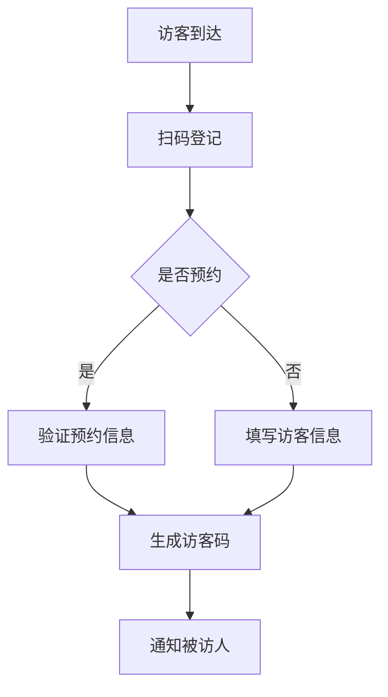

 # 访客系统产品需求文档(PRD)

## 1. 文档信息

| 文档状态 | 创建日期 | 最后修改日期 | 版本号 |
|---------|----------|--------------|--------|
| 创建中   | 2024-01-20 | 2024-01-20  | V1.0   |

## 2. 产品概述

### 2.1 产品背景
- 提升企业访客管理的规范性和安全性
- 优化访客登记流程，提高接待效率
- 实现访客数据的电子化管理

### 2.2 产品目标
- 简化访客登记流程
- 加强企业安全管理
- 提供访客数据分析
- 改善访客体验

## 3. 功能需求

### 3.1 访客登记


#### 3.1.1 基本信息登记
- 姓名
- 手机号
- 身份证号
- 来访目的
- 被访人信息

#### 3.1.2 预约登记
- 预约时间
- 预约事由
- 预计来访时长

### 3.2 访客审批
- 被访人审批
- 安保人员审核
- 审批结果通知

### 3.3 访客管理
- 访客记录查询
- 黑名单管理
- 访客统计分析
- 常用访客快速通行

## 4. 非功能需求

### 4.1 性能需求
- 系统响应时间 < 2秒
- 支持并发访问量 > 100人/分钟
- 7*24小时稳定运行

### 4.2 安全需求
- 数据加密存储
- 访问权限控制
- 操作日志记录

### 4.3 兼容性要求
- 支持主流浏览器
- 支持移动端适配

## 5. 界面原型

### 5.1 访客登记界面
```
+----------------------+
|    访客登记系统     |
+----------------------+
|   □ 预约登记        |
|   □ 临时访客        |
+----------------------+
| 姓名：[          ]  |
| 电话：[          ]  |
| 证件：[          ]  |
+----------------------+
|     [提交登记]      |
+----------------------+
```

### 5.2 审批界面
```
+----------------------+
|    访客审批管理     |
+----------------------+
| □ 待审批  □ 已审批  |
+----------------------+
| 访客信息：          |
| 时间：             |
| 事由：             |
+----------------------+
| [通过]    [拒绝]    |
+----------------------+
```

## 6. 数据需求

### 6.1 数据存储
- 访客基本信息
- 预约记录
- 访问记录
- 审批记录

### 6.2 数据统计
- 访客流量统计
- 访问时长分析
- 区域访问热力图

## 7. 项目规划

### 7.1 开发周期
- 需求分析：2周
- 开发实现：8周
- 测试部署：2周

### 7.2 优先级
1. 访客登记功能
2. 审批流程
3. 数据统计分析
4. 系统优化

## 8. 附录

### 8.1 术语说明
- 访客码：唯一身份识别码
- 预约登记：提前进行的访问申请
- 临时访客：未预约的现场登记访客

### 8.2 修订记录
| 版本号 | 修订日期 | 修订内容 | 修订人 |
|--------|----------|----------|--------|
| V1.0   | 2024-01-20 | 创建文档 | PM |