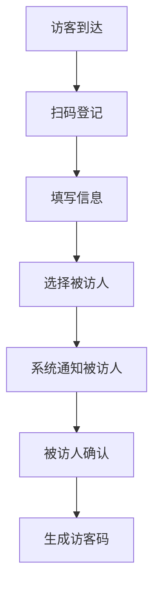
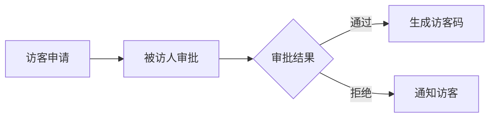

 # 访客系统产品需求文档(PRD)

## 1. 文档信息

- 文档状态：初稿
- 版本号：V1.0
- 作者：产品经理
- 最后更新日期：2024-01-01

## 2. 修订历史

| 版本号 | 修订日期 | 修订人 | 修订说明 |
|--------|----------|--------|----------|
| V1.0   | 2024-01-01 | PM | 初稿创建 |

## 3. 产品概述

### 3.1 产品背景
为提升企业访客管理的规范性和安全性，开发访客系统对来访人员进行统一管理。

### 3.2 产品目标
- 规范访客登记流程
- 提高访客管理效率
- 增强企业安全管理
- 改善访客体验

## 4. 功能需求

### 4.1 访客登记


#### 4.1.1 基本信息采集
- 访客姓名
- 手机号码
- 身份证号
- 来访目的
- 预计来访时间
- 预计离开时间

#### 4.1.2 被访人选择
- 搜索被访人
- 选择部门
- 填写来访事由

### 4.2 访客审批


### 4.3 访客通行
- 门禁系统对接
- 访客码核验
- 访问时间控制

### 4.4 访客离场
- 自动记录离场时间
- 访问状态更新
- 访客满意度调查

## 5. 非功能需求

### 5.1 性能需求
- 系统响应时间 < 2秒
- 并发访问量支持 100 人/分钟
- 系统可用性 99.9%

### 5.2 安全需求
- 数据加密传输
- 访客信息脱敏处理
- 访问权限控制
- 操作日志记录

## 6. 界面原型

### 6.1 访客登记界面
```
+------------------------+
|     访客登记系统       |
+------------------------+
| 姓名: [          ]     |
| 电话: [          ]     |
| 证件: [          ]     |
|                        |
| 被访人: [选择]         |
| 来访事由: [     ]      |
|                        |
| [提交登记]             |
+------------------------+
```

### 6.2 审批界面
```
+------------------------+
|     访客审批          |
+------------------------+
| 访客信息              |
| 姓名：张三            |
| 来访事由：商务洽谈     |
|                        |
| [同意] [拒绝]         |
+------------------------+
```

## 7. 数据设计

### 7.1 数据表结构
- 访客信息表
- 被访人信息表
- 访问记录表
- 审批记录表

## 8. 实施计划

### 8.1 开发排期
- 需求分析：5天
- 系统设计：7天
- 开发实现：20天
- 测试验证：8天
- 部署上线：2天

### 8.2 风险评估
1. 系统稳定性风险
2. 数据安全风险
3. 用户适应性风险

## 9. 附录

### 9.1 术语说明
- 访客码：用于访客通行的唯一标识
- 被访人：企业内部接待访客的员工

### 9.2 相关文档
- 《访客管理制度》
- 《安全保密协议》