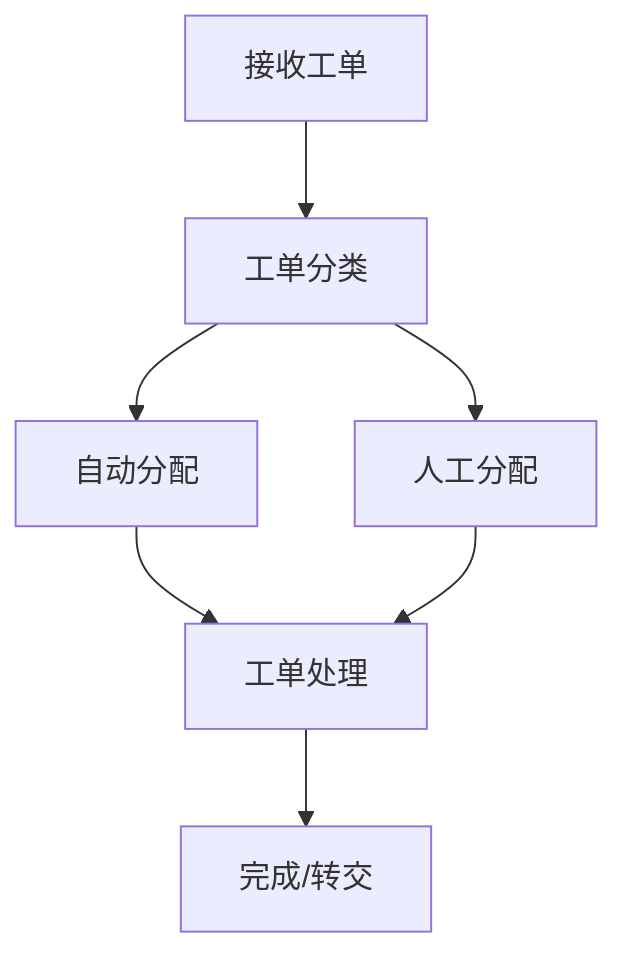
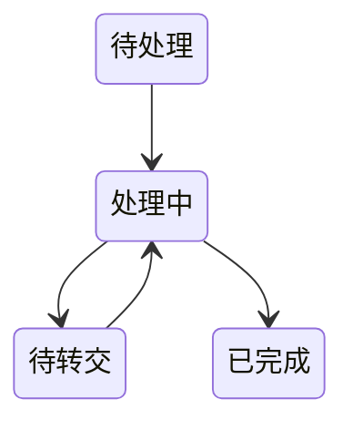

 # 咨询工单转交系统产品需求文档

|文档信息||
|---|---|
|作者|小美|
|最后更新日期|2025-03-21|
|文档状态|编写中|

## 1. 文档简介

### 1.1 目的
设计一个咨询工单转交系统，实现工单的高效分配和处理，提升客服团队的工作效率和客户满意度。

### 1.2 范围
系统覆盖工单接收、分配、转交、处理等全流程管理。

## 2. 产品概述

### 2.1 产品背景
- 客服团队工单量大，需要高效的转交分配机制
- 专业问题需要及时转给相应领域专家
- 需要跟踪工单处理状态和效率

### 2.2 用户画像
- 客服人员：一线接待客户咨询
- 专业顾问：处理专业性问题
- 客服主管：负责工单分配和监控
- 系统管理员：维护系统配置

## 3. 功能需求

### 3.1 工单管理


#### 3.1.1 工单接收
- 支持多渠道工单接入
- 自动生成工单编号
- 记录工单基础信息

#### 3.1.2 工单分配
- 支持自动分配规则配置
- 支持人工指定分配
- 实时显示坐席工作负载

#### 3.1.3 工单转交
- 支持跨部门转交
- 转交原因必填
- 记录转交历史
- 通知相关处理人

### 3.2 状态流转


### 3.3 数据统计
- 工单量统计
- 处理时效分析
- 转交率统计
- 满意度统计

## 4. 非功能需求

### 4.1 性能需求
- 系统响应时间<2秒
- 支持并发处理>1000工单/分钟

### 4.2 安全需求
- 角色权限控制
- 操作日志记录
- 数据加密传输

### 4.3 可用性需求
- 系统可用性99.9%
- 支持7×24小时运行
- 提供数据备份方案

## 5. 界面原型

### 5.1 工单列表
```
+------------------------+
|  工单列表              |
+------------------------+
| 编号 状态 主题 处理人  |
|------------------------|
| #001 处理中 XX  张三   |
| #002 待处理 YY  李四   |
+------------------------+
```

### 5.2 转交界面
```
+------------------------+
|  工单转交              |
+------------------------+
| 转交至: [下拉选择]     |
| 转交原因: [文本框]     |
| [确认] [取消]          |
+------------------------+
```

## 6. 验收标准

### 6.1 功能验收
- 工单转交流程完整
- 状态流转正确
- 数据统计准确

### 6.2 性能验收
- 满足性能指标要求
- 稳定运行无异常