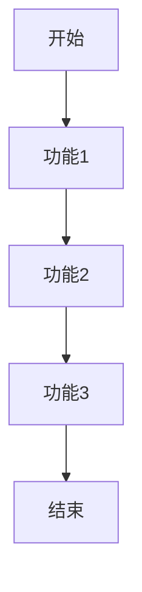

 # 产品需求文档（PRD）

## 1. 文档信息
- 文档版本：V1.0
- 创建日期：2024-01-01
- 产品名称：Test产品
- 文档状态：初稿

## 2. 修订历史
| 版本号 | 修订日期 | 修订人 | 修订说明 |
|--------|----------|--------|----------|
| V1.0   | 2024-01-01 | PM | 初始版本 |

## 3. 产品概述
### 3.1 产品背景
测试产品需求文档的编写规范和格式。

### 3.2 产品目标
完成一份标准的产品需求文档示例。

## 4. 功能需求
### 4.1 核心功能


### 4.2 功能详情
#### 4.2.1 功能1
- 基本描述
- 功能入口
- 操作流程
- 业务规则

#### 4.2.2 功能2
- 基本描述
- 功能入口
- 操作流程
- 业务规则

## 5. 非功能需求
### 5.1 性能需求
- 响应时间
- 并发量
- 系统容量

### 5.2 安全需求
- 数据安全
- 访问控制
- 隐私保护

## 6. 界面原型
### 6.1 首页布局
```
+-----------------+
|    头部导航     |
+-----------------+
|                 |
|    主要内容     |
|                 |
+-----------------+
|    底部信息     |
+-----------------+
```

## 7. 附录
### 7.1 术语表
| 术语 | 解释 |
|------|------|
| 示例1 | 说明1 |
| 示例2 | 说明2 |

### 7.2 参考文档
- 参考文档1
- 参考文档2