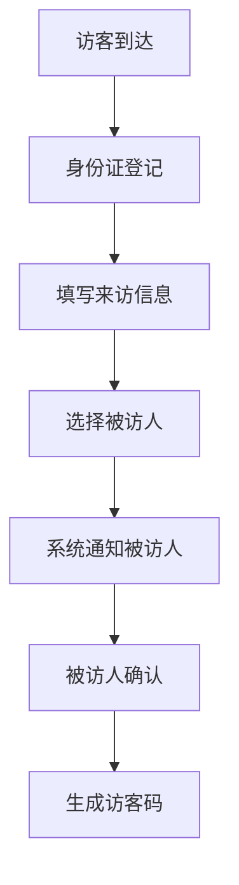
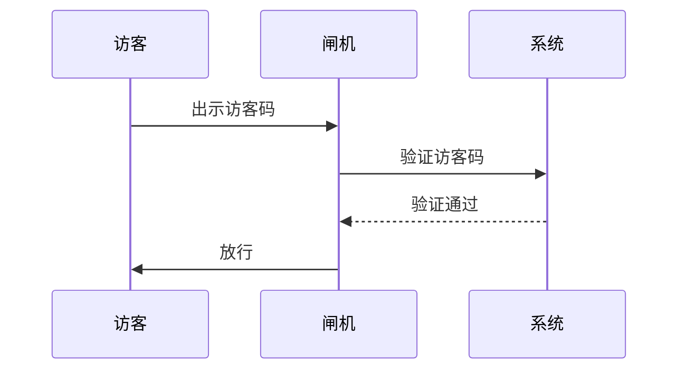

 # 访客系统产品需求文档

## 1. 文档信息

- 文档状态：草稿
- 编写人：产品经理
- 创建时间：2024-01-01
- 最后修改时间：2024-01-01
- 文档版本：V1.0

## 2. 产品概述

### 2.1 产品背景
为提升办公楼/园区的安全管理水平，规范访客登记流程，开发访客系统对来访人员进行统一管理。

### 2.2 产品目标
- 规范访客登记流程
- 提高门岗安保工作效率
- 加强访客数据管理
- 提升园区安全管理水平

## 3. 功能需求

### 3.1 系统角色
- 系统管理员
- 前台接待
- 保安
- 被访人
- 访客

### 3.2 核心功能模块

#### 3.2.1 访客登记


#### 3.2.2 访客通行


#### 3.2.3 数据管理
- 访客记录查询
- 访客统计报表
- 黑名单管理
- 访客记录导出

### 3.3 功能清单
| 功能模块 | 功能点 | 功能描述 |
|---------|--------|----------|
| 访客登记 | 身份识别 | 支持身份证读取、人脸识别 |
| | 信息填写 | 访客基本信息、来访事由等 |
| | 预约管理 | 支持访客预约、预约审批 |
| 通行管理 | 访客码生成 | 生成唯一的通行凭证 |
| | 权限控制 | 限定访客活动区域和时间 |
| 系统管理 | 用户管理 | 管理系统各类用户账号 |
| | 权限配置 | 配置不同角色的操作权限 |

## 4. 非功能需求

### 4.1 性能需求
- 系统响应时间：<3秒
- 并发用户数：>100
- 系统可用性：99.9%

### 4.2 安全需求
- 数据加密传输
- 访客信息脱敏处理
- 操作日志记录

### 4.3 兼容性要求
- 支持主流浏览器
- 支持移动端访问

## 5. 界面原型

### 5.1 访客登记界面
```
+------------------------+
|     访客登记系统        |
+------------------------+
| 姓名:[____________]    |
| 证件号:[___________]   |
| 手机号:[___________]   |
| 来访事由:[_________]   |
| 被访人:[___________]   |
|                        |
| [确认登记]  [重置]     |
+------------------------+
```

### 5.2 访客管理界面
```
+------------------------+
| 访客管理               |
+------------------------+
| 搜索:[____________]    |
+------------------------+
| 访客列表               |
|                        |
| 姓名 时间 状态 操作    |
| ------------------- |
| 张三 9:00 在访 详情    |
| 李四 8:30 离开 详情    |
+------------------------+
```

## 6. 项目实施

### 6.1 开发周期
- 需求分析：2周
- 设计开发：8周
- 测试部署：2周
- 总周期：12周

### 6.2 风险评估
- 数据安全风险
- 系统稳定性风险
- 用户适应性风险

## 7. 附录

### 7.1 术语说明
- 访客码：访客通行的电子凭证
- 黑名单：禁止进入的访客名单

### 7.2 相关文档
- 《访客管理制度》
- 《系统操作手册》