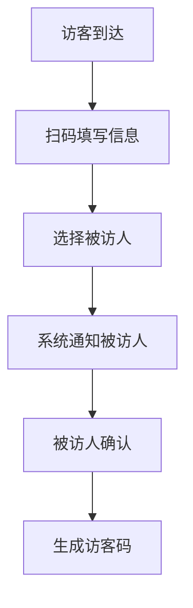

 # 访客系统产品需求文档

## 1. 文档信息
- 文档状态：初稿
- 版本号：V1.0
- 作者：产品经理
- 最后更新日期：2024-01-01

## 2. 产品概述
### 2.1 产品背景
为提升企业访客管理效率，实现访客信息数字化管理，开发访客系统。

### 2.2 产品目标
- 规范访客登记流程
- 提高访客管理效率
- 保障企业安全

## 3. 功能需求
### 3.1 访客登记


#### 3.1.1 基本信息登记
- 姓名（必填）
- 手机号（必填）
- 身份证号（必填）
- 来访目的（必填）
- 车牌号（选填）

#### 3.1.2 被访人选择
- 搜索被访人
- 选择部门
- 确认被访信息

### 3.2 访客审批
- 被访人接收通知
- 审批操作（同意/拒绝）
- 填写来访时间

### 3.3 访客管理
- 访客记录查询
- 访客状态显示
- 黑名单管理
- 访客统计报表

### 3.4 系统设置
- 访客权限配置
- 访问区域设置
- 访问时间管理

## 4. 非功能需求
### 4.1 性能需求
- 系统响应时间<2秒
- 支持并发访问量>100人

### 4.2 安全需求
- 数据加密存储
- 访客信息脱敏
- 操作日志记录

## 5. 界面原型
### 5.1 访客登记页
```
+----------------------+
|     访客登记        |
+----------------------+
| 姓名:[          ]   |
| 手机:[          ]   |
| 证件:[          ]   |
| 目的:[          ]   |
| 车牌:[          ]   |
|                     |
| [选择被访人]        |
|                     |
| [提交登记]          |
+----------------------+
```

### 5.2 审批页面
```
+----------------------+
|     访客审批        |
+----------------------+
| 访客信息：          |
| 姓名：张三          |
| 来访目的：商务洽谈  |
|                     |
| [同意] [拒绝]       |
+----------------------+
```

## 6. 项目规划
### 6.1 开发周期
- 需求评审：5个工作日
- 开发周期：20个工作日
- 测试周期：10个工作日
- 上线准备：5个工作日

### 6.2 项目里程碑
1. 需求确认完成
2. 开发完成
3. 测试通过
4. 正式上线

## 7. 附录
### 7.1 术语说明
- 访客码：访客通行凭证
- 黑名单：禁止访问的人员名单

### 7.2 修订记录
| 版本号 | 修订日期 | 修订内容 | 修订人 |
|--------|----------|----------|--------|
| V1.0   | 2024-01-01 | 初稿创建 | PM |